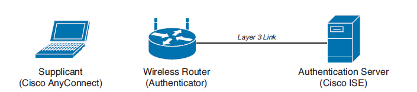
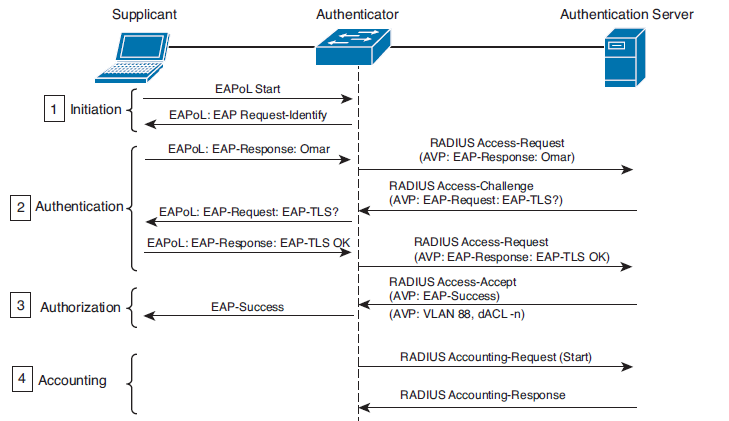

# 🔐 802.1X & RADIUS: The Mechanics of Network Access Control

The **802.1X** standard works exactly the same way for both wired (Ethernet) and wireless (Wi-Fi) connections. It is one of the many tools used to build a robust **NAC (Network Access Control)** architecture.

### 🏛️ The Three Core Components

  

1.  **Supplicant:** The endpoint device (e.g., your laptop or smartphone) trying to connect to the network.
2.  **Authenticator:** The network device (e.g., a Switch or WLC). It acts as the gatekeeper. Sometimes referred to as the **PEP (Policy Enforcement Point)** because it enforces the rules.
3.  **Authentication Server:** The central brain (e.g., Cisco ISE). Sometimes referred to as the **PDP (Policy Decision Point)** because it makes the final decision on whether to allow access.

### 🗣️ The Three Protocols in Play

To make this architecture work, three different protocols are used depending on where the traffic is flowing:
*   **EAPoL (EAP over LAN):** Used for transmission strictly between the Supplicant and the Authenticator (Layer 2).
*   **EAP (Extensible Authentication Protocol):** The actual authentication payload traveling between the Supplicant and the Authentication Server.
*   **RADIUS (or Diameter):** The protocol used between the Authenticator (Switch) and the Authentication Server (ISE) to carry the EAP messages over the network (Layer 3/4).

---

### 🔄 The 802.1X Exchange (Step-by-Step)

Let's trace the communication model when an employee (let's call him Omar) brings his laptop and wants to connect to the network. He types in his username and password. What happens under the hood?

  

The process is divided into 4 distinct phases:

#### Phase 1: Initiation
*   If the laptop was just asleep (meaning the switch port was always `up`), the Switch initiates the communication by sending an `EAP-Request Identity` message.
*   If you just plugged in the cable or turned on the laptop (the switch port suddenly goes `up`), the Laptop initiates it by sending the first `EAPoL-Start` message.
> **🛑 Crucial Security Note:** Before authentication is successful, the switch port is in an "unauthorized" state. It drops all traffic EXCEPT for specific control protocols like CDP, STP, and EAPoL. You cannot get an IP address via DHCP yet!

#### Phase 2: Session Authentication
*   As seen in the diagram, Omar sends his username (Identity) *without* the password first.
*   The Switch takes this EAP message, packs it into a **UDP Port 1812 (RADIUS)** packet, adds its own switch details, and sends it to ISE.
*   **`RADIUS Access-Challenge`:** ISE replies to the switch: *"Okay, I see Omar, but we need to negotiate an encryption/login method."* The word "Challenge" means the server isn't saying "Yes" or "No" yet; it is forcing the next step (e.g., asking for an EAP-TLS certificate). The switch extracts the EAP message and hands it to Omar.

#### Phase 3: Session Authorization (The Finale)
*   **`RADIUS Access-Accept`:** The Holy Grail of authorization. ISE sends this to the switch. It means: *"Authentication successful."* More importantly for an engineer, this packet contains the **AV-Pairs (Attributes)**, such as assigning Omar to VLAN 88 or pushing down a dACL (Downloadable ACL). The switch immediately applies these rules to the port.
*   **`EAP-Success`:** The final EAPoL frame. The switch tells the Supplicant: *"You are logged in, the port is open."* From this exact millisecond, the computer is allowed to send a DHCP request and start normal network traffic.

#### Phase 4: Session Accounting (For the Visibility Guys!)
*   **`RADIUS Accounting-Request (Start)`:** Sent over **UDP Port 1813**. The switch reports to ISE: *"Omar's session has just started."* If you work with NetFlow or Stealthwatch, you will appreciate this—this packet is why ISE logs show the exact start time, IP address, MAC, and physical port number of the session. Full visibility!
*   **`RADIUS Accounting-Response`:** A simple acknowledgment from ISE: *"Got your report, saved it to the database."*

---

### 🗂️ Deep Dive: AV-Pairs & How EAP fits into RADIUS

You must understand what an **AV-Pair (Attribute-Value Pair)** is. 

RADIUS is like a strict bureaucratic form. You cannot just throw random information into it. Everything must have a specific attribute number and a specific value.

**How does a RADIUS `Access-Request` packet look inside?**
When the switch builds the packet, it fills out this form with various details for the ISE server:
*   `Attribute 1 (User-Name)` = **Value:** Omar
*   `Attribute 4 (NAS-IP-Address)` = **Value:** 10.0.0.1 *(The IP of our switch)*
*   `Attribute 61 (NAS-Port-Type)` = **Value:** Ethernet *(Tells ISE we are connecting via cable, not Wi-Fi)*

**So, where does the EAP message go?**
This is where the magic happens! RADIUS has a special, dedicated slot just for this: **Attribute 79**.
*   `Attribute 79 (EAP-Message)` = **Value:** `[THE SWITCH PASTES THE ENTIRE EAP LETTER FROM THE SUPPLICANT HERE]`

**Summary of the encapsulation:**
The Switch strips off the Layer 2 headers (`EAPoL`), takes the pure `EAP` payload, opens the RADIUS form, finds the slot named `EAP-Message` (Attribute 79), stuffs the EAP payload inside, seals the packet in UDP, and sends it out into the world to the ISE server.