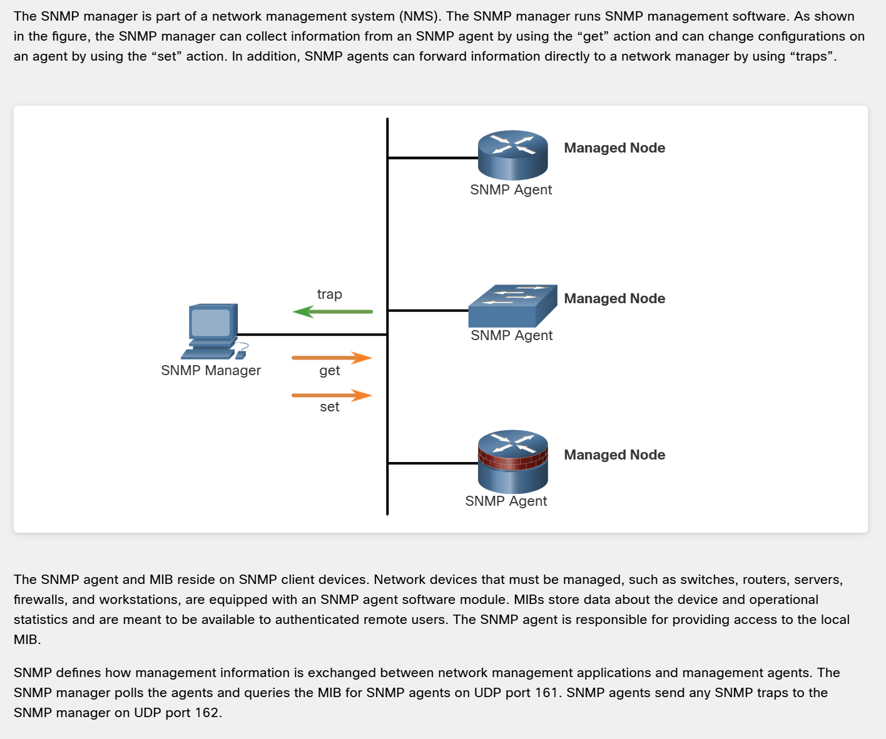
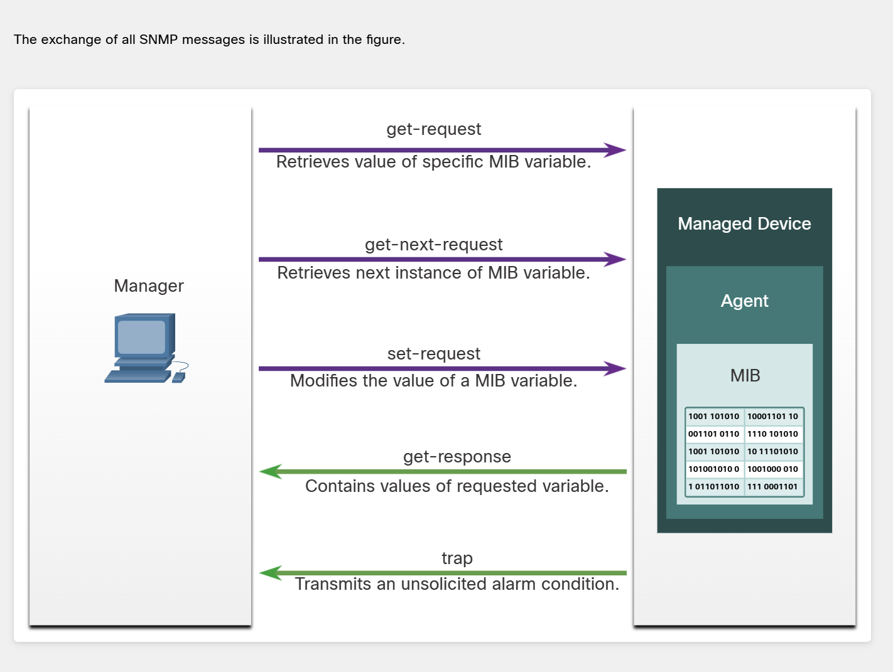

# 📡 SNMP: Architecture, Versions & MIBs

There are 3 main versions of the SNMP protocol:

*   **SNMPv1 (`noAuthNoPriv`)** -> Obsolete. It is practically never used today. It provides no authentication and no encryption. The *community string* acts as a sort of password, but we do not consider it true authentication.
*   **SNMPv2c (`noAuthNoPriv`)** -> Similar to version 1, but slightly improved. It includes the ability to fetch data in bulk (via `GetBulk`) and features better error handling.
*   **SNMPv3:**
    *   `noAuthNoPriv`: No authentication, no encryption.
    *   `authNoPriv`: Authentication via HMAC-MD5 or HMAC-SHA algorithms, but no encryption.
    *   `authPriv`: Full authentication and encryption.

---

### 🏛️ SNMP Architecture

  

  

The architecture relies on two main components:
1.  **Agents:** We activate them on routers, switches, servers, or Cisco firewalls. They simply have a built-in SNMP module that we enable.
2.  **SNMP Manager (NMS):** The monitoring server, for example, PRTG or Zabbix.

---

### 🗂️ MIB Database & OIDs

Both the Agents and the SNMP Manager contain a **MIB (Management Information Base)**. It acts as a virtual database. 
**OID (Object Identifier)** - is a long string of numbers (e.g., `1.3.6.1.4.1.9...`) that serves as an exact address for specific information in the MIB database. The server sends an OID to ask for a specific metric.

**The MIB on the Agent (e.g., on a switch):**
This is a "live" database built into the operating system. Physical values are recorded here in real-time. The agent knows that under a specific OID number (e.g., `1.3.6.1.2.1.2.2.1.8`), it holds the current status of the `GigabitEthernet0/1` port.

**The MIB on the SNMP Manager (Monitoring server, e.g., PRTG / Zabbix):**
Here, MIBs are simply text files (templates / dictionaries) that you upload to the system. 
*Why does the NMS need this file?* When the NMS queries the router, the router only sends back raw numbers: *"The value for 1.3.6.1.2.1.2.2.1.8 is 1"*. The NMS is dumb. It doesn't know what that means. So, it looks into the uploaded MIB file (the dictionary) and translates it into human language: *"Aha! This long string of digits means 'ifOperStatus', and the value '1' means 'Up'. So the port is working!"*.

---

### 📥 PULL vs 📤 PUSH (Crucial Concept)

Remember the mechanics of how data moves:
*   **PULL:** Achieved via **`GET`** requests.
*   **PUSH:** Achieved via **`TRAP`** messages.

> **💡 The Engineering Conclusion:** 
> SNMP polling (querying via `GET`) is performed periodically (e.g., every 5 minutes). Sometimes it is much better to configure a `TRAP` so that the device immediately triggers sending information to the server the exact moment an important event occurs (e.g., a port going down).