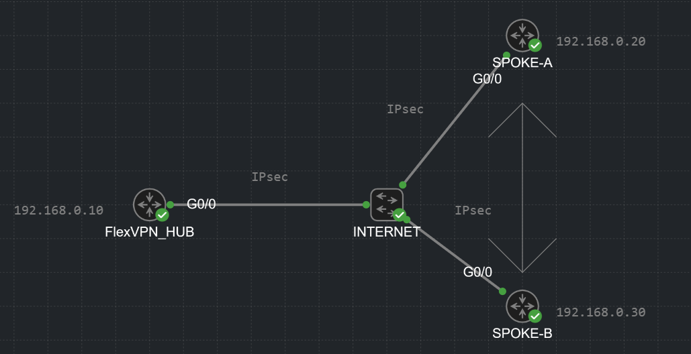

# 🛠️ LAB: FlexVPN Spoke-to-Spoke (Direct Tunnels)

Since we have already built the FlexVPN Hub-and-Spoke topology, there isn't much heavy lifting left to do. To enable direct Spoke-to-Spoke communication, we just need to add a few commands and introduce the **NHRP (Next Hop Resolution Protocol)**.

### 🗺️ The Topology

  

---

### ⚙️ The Delta Configuration (What changes?)

Below is a side-by-side comparison showing **ONLY the new or modified commands** required to upgrade our previous Hub-and-Spoke setup into a dynamic Spoke-to-Spoke network.

<table style="width:100%; border-collapse: collapse; font-family: monospace; font-size: 13px;">
  <tr style="background-color: #333; color: #00ff00; text-align: left;">
    <th style="padding: 10px; border: 1px solid #555; width: 50%;">The HUB (R1) Additions</th>
    <th style="padding: 10px; border: 1px solid #555; width: 50%;">The SPOKE (R2 & R3) Additions</th>
  </tr>
  <tr>
    <td style="padding: 10px; border: 1px solid #555; vertical-align: top; background-color: #000; color: #e6e6e6;">
      ! 1. Modify the ACL (The Care Package) 
      no ip access-list standard FlexTraffic 
      ip access-list standard FlexTraffic 
       permit 10.0.0.0 0.255.255.255  
      ! 2. Enable NHRP on the Virtual-Template 
      interface Virtual-Template 1 type tunnel 
       ip nhrp network-id 1 
       ip nhrp redirect 
    </td>
    <td style="padding: 10px; border: 1px solid #555; vertical-align: top; background-color: #000; color: #e6e6e6;">
      ! 1. Link the Profile to a Template 
      crypto ikev2 profile FLEXVPN_PROFILE 
       virtual-template 1  
      ! 2. Create the Spoke's Cloning Machine 
      interface Virtual-Template 1 type tunnel 
       ip unnumbered Tunnel0 
       ip nhrp network-id 1 
       ip nhrp shortcut 
       tunnel protection ipsec profile FLEXVPN_PROFILE  
      ! 3. Enable NHRP on the Main Tunnel 
      interface Tunnel0 
       ip nhrp network-id 1 
       ip nhrp shortcut virtual-template 1 
    </td>
  </tr>
</table>

---

### 🧠 Deep Dive: Explaining the Magic

#### 1. The Summary Route ACL (Hub)
*   **Old:** `permit 10.10.1.0 0.0.0.255`
*   **New:** `permit 10.0.0.0 0.255.255.255`
**Why?** This ACL dictates what routes the Hub pushes to the Spokes. Previously, it only pushed its own LAN. Now, we push a massive summary route (`10.0.0.0/8`). This tells Spoke-A: *"If you want to reach ANY 10.x.x.x network (including Spoke-B), send the packet to me first!"*. Without this, Spoke-A wouldn't even try to reach Spoke-B.

#### 2. The Step-by-Step Tunnel Creation (NHRP Redirect & Shortcut)
How do the routers actually build the direct tunnel?
1.  **The Trigger:** Spoke-A sends a ping to Spoke-B. The packet flies to the Hub because Spoke-A doesn't know any other way.
2.  **The Redirect (Hub):** The Hub forwards the packet to Spoke-B, but simultaneously sends a control message back to Spoke-A: *"Hey, Spoke-B is available at public IP 192.168.0.30. Build a shortcut to him!"* (`ip nhrp redirect`).
3.  **The Shortcut (Spoke-A):** Spoke-A fires up its cloning machine (`Virtual-Template 1`), creates a `Virtual-Access` interface, and sends an IKEv2 request directly to Spoke-B's public IP. (`ip nhrp shortcut virtual-template 1`).
4.  **The Negotiation:** Spoke-B receives the request, verifies the password (from the Keyring), and the direct tunnel comes up.

---

### 🛑 Troubleshooting: The Locked Template Error

While configuring the Hub, you might try to edit the `Virtual-Template 1` and receive this error:
`% Virtual-template config is locked, active vaccess present`

**What does this mean?**
This is a safety mechanism. You are trying to edit the "cookie cutter" (the Template) while the router currently has active "cookies" (Virtual-Access interfaces) in its RAM serving live user traffic. The OS locks the template to prevent you from breaking active tunnels.
**The Fix:** Simply tear down the active tunnels using the command `clear crypto ikev2 sa`. The Virtual-Access interfaces will drop, the lock will be released, and you can edit your template.

---

### 🕵️‍♂️ The Routing Table Mystery: `H` vs `S %`

After the direct tunnel comes up, if you look at the routing table, you will witness a fascinating battle between two protocols. 

I ran `show ip route` twice in a row. Look at what I caught on the first try:

<pre style="background-color: #000000; color: #00ff00; padding: 15px; font-size: 13px; border-radius: 8px; border: 1px solid #444; line-height: 1.2;">
SPOKE-A# show ip route
[...snip...]
H        10.1.1.5/32 is directly connected, 00:01:00, Virtual-Access1
H        10.30.3.0/24 [250/255] via 10.1.1.5, 00:01:00, Virtual-Access1
</pre>

And then, a fraction of a second later, I ran it again:

<pre style="background-color: #000000; color: #00ff00; padding: 15px; font-size: 13px; border-radius: 8px; border: 1px solid #444; line-height: 1.2;">
SPOKE-A# show ip route
[...snip...]
S   %    10.1.1.5/32 is directly connected, Virtual-Access1
S   %    10.30.3.0/24 is directly connected, Virtual-Access1
</pre>

**What just happened on the timeline? (Who killed the 'H' route?)**

*   **Actor 1: The NHRP Protocol (Letter `H`)**
    When you send the first ping, NHRP acts at lightning speed. It asks the Hub for Spoke-B's address, gets the reply, and *instantly* installs an `H` route in the routing table so packets can start flowing. 
    Notice the numbers in the brackets: `[250/255]`. The number **250** is the Administrative Distance (AD) for NHRP. In the Cisco world, the higher the AD, the "weaker" and less trustworthy the route is. 250 is almost at the very bottom of the hierarchy.

*   **Actor 2: IKEv2 Route Push (Letter `S %`)**
    Remember the "Care Package" the Hub gave the Spokes? In this lab, Spoke-B has the exact same authorization policy configured! 
    When the IKEv2 `Virtual-Access` tunnel between Spoke-A and Spoke-B finally comes up, Spoke-B acts like a mini-server and injects its own LAN route into Spoke-A via the IKEv2 protocol! 
    Routes injected by IKEv2 are treated as Static routes (`S`) and have an Administrative Distance of **1** (the highest possible priority after directly connected routes).

**The Conclusion:**
In the first output, I caught the router perfectly in the act! NHRP had already resolved the address and threw in the weak `H` route (AD 250). The IKEv2 tunnel was still negotiating in the background.
In the second output, the IKEv2 tunnel fully stabilized. Spoke-B injected the static `S` route (AD 1). Because 1 is much stronger than 250, **the Static route brutally knocked out the NHRP route and kicked it out of the routing table!** 

> **💡 What does the `%` mean?**
> The `%` sign stands for **Next-Hop Override**. It was added by NHRP to inform the router: *"Yes, this is a Static route, but I dynamically modified its exit interface so that it flows through this brand new Virtual-Access shortcut instead of the Hub."*