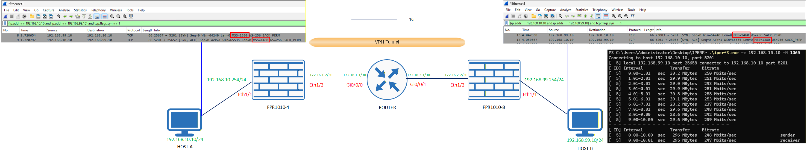
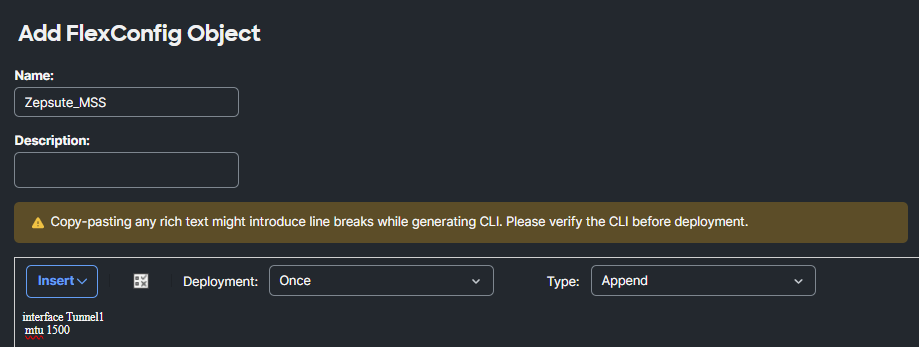
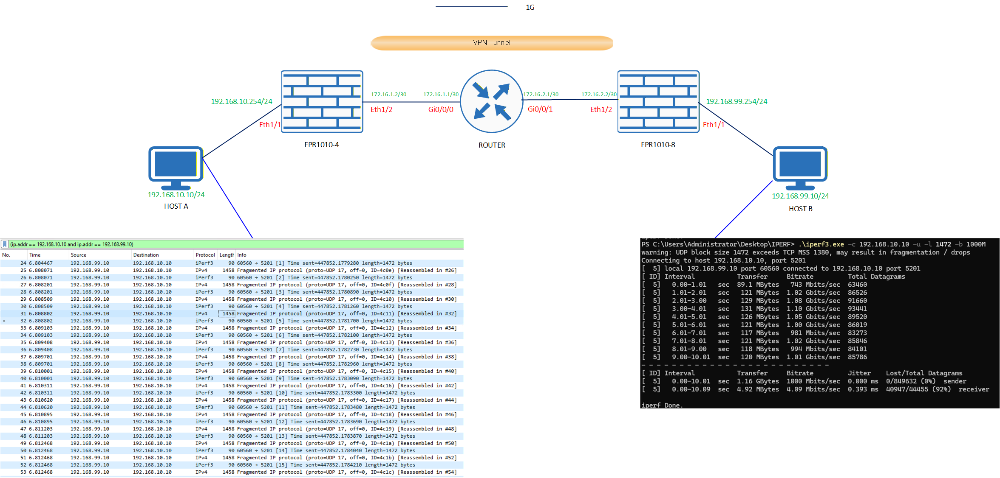
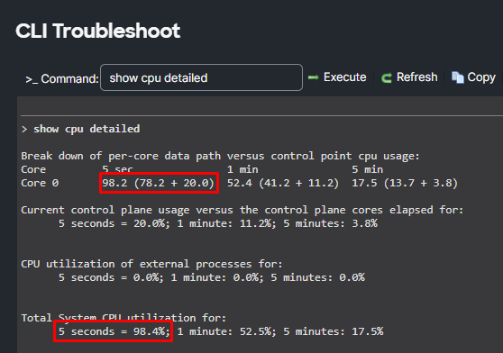
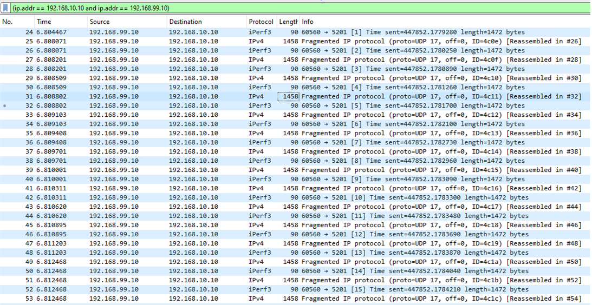
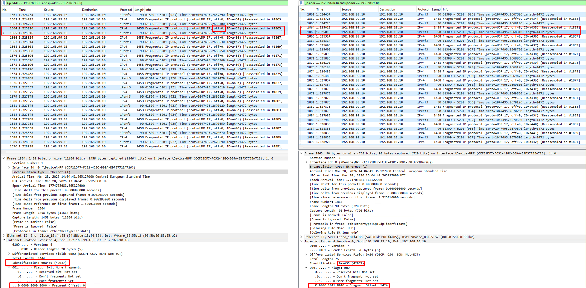

# 🔬 LAB: IPsec Fragmentation & MSS Adjustment on Cisco FTD

The goal of this experiment is to intentionally trigger IP fragmentation on Firepower (FPR) firewalls and observe the behavior on the endpoints (two Windows VMs running Wireshark 🦈).

  

In this topology, we have an IPsec Site-to-Site VPN built on VTI using IKEv2 with an **AES-GCM** proposal. This is important because AES-GCM significantly reduces the header overhead. 

The physical interface MTU is 1500 bytes. Based on this, `Tunnel1` is created with an MTU of 1445 bytes.

<pre style="background-color: #000000; color: #00ff00; padding: 15px; font-size: 14px; border-radius: 8px; border: 1px solid #444; line-height: 1.2;">
FPR# show interface Tunnel1 | include MTU
  Hardware is Virtual Tunnel, MAC address N/A, MTU 1445
      IPsec MTU Overhead : 55
</pre>

> **💡 Note on Overhead:** We were always taught that IPsec overhead is around 72 bytes. However, because we are using AES-GCM, the overhead is only 55 bytes. AES-GCM is an absolute game-changer today.

---

### 1️⃣ MSS Adjustment on Firepower (The "Eraser" Effect)

By default, FTDs have TCP MSS adjustment enabled. This means that when they see a TCP SYN packet passing through with a specific proposed MSS, they take a virtual eraser, rub out the original value, and paste their own calculated MSS.

To prove this theory, I ran some tests. I initiated an `iperf` session from Computer B (IP: `192.168.99.10`). In Wireshark running on Computer B, we can clearly see the MSS value we are trying to negotiate:

  

 

As seen in the capture, Computer B tries to negotiate an MSS of **1460**, but receives a SYN-ACK with an MSS of **1380**. 

Okay, we could argue that maybe Computer A (our server) somehow just prefers 1380. So, let's look at the incoming traffic on Computer A's Wireshark. The incoming SYN from Computer B arrives with an MSS of 1380! The firewall clearly erased the 1460 and injected 1380. 

But wait... why is the return SYN-ACK from Computer A set to 1460? If Computer A sees an incoming request for 1380, why does it reply with 1460?

#### 🧠 Deep Dive: The TCP 3-Way Handshake & Independent Pipes

Let's go back to the TCP protocol for a moment.

The SYN received from Computer B says *only and exclusively*: **"Please send packets through this pipe to me with an MSS of 1380, because my network card cannot process any more."**

Computer A replies: **"Alright, if that's what you want, I'll do it -> ACK flag. However, please send packets to ME with an MSS of 1460, because I have a better card."** So Computer A sends a SYN with 1460, which together makes a SYN-ACK.

As you can see, there are 2 independent pipes here. In one pipe, packets fly with an MSS of 1380, and in the other, packets fly with 1460. At the very end, we just have an ACK, meaning Computer B agrees to that 1460.

But what if one host is downloading and the other is only sending acknowledgments? Do we only need such a large MSS for one of them? Will one pipe be thinner than the other? **Absolutely not.**

The MSS value has absolutely nothing to do with what the application intends to do (whether it will download 100 GB of movies or just send one email).

MSS is rigidly tied to the hardware (the network card). The operating system does not ask the web browser: *"Hey, are you going to download a lot?"*. The operating system only looks at the network card and says: *"The card has an MTU of 1500, so my MSS is 1460. End of discussion."*

**When are the pipes ACTUALLY asymmetric?**
Only when the hardware or network on one side is worse. 
*Example:* You are sitting in the office on a fiber connection (MTU 1500 -> MSS 1460). Your colleague is sitting on a train using an old LTE modem with a VPN enabled (MTU 1340 -> MSS 1300). In that case, the pipes will be physically asymmetric (1460 one way, 1300 the other), regardless of who is downloading the file from whom.

Returning to our topology: the 1460 MSS transmission from Computer A gets changed by FPR-A to 1380. So, one FPR uses the eraser for one host, and the other FPR does it for the second host. The computers have no idea who changed it. They think they negotiated it themselves!

#### 💥 The Attempt to Break It (FlexConfig)

But let's return to the attempt to disable this pesky MSS adjustment so the firewall stops erasing it. This would allow us to force fragmentation and overload the hardware. 

I looked for this option in the FMC (Firepower Management Center) GUI and, as it turns out, it doesn't exist anywhere. So, I came up with the idea to bypass FMC and inject it directly into the underlying legacy ASA engine (the LINA process). I found out it is possible via **FlexConfig** using the `sysopt connection tcpmss` command.

  

However, I got an error. As it turned out later, it cannot be done because the Tunnel MTU is calculated dynamically based on the physical MTU, and the MSS is calculated based on that Tunnel MTU. Even if we change the physical MTU, the tunnel MTU will just adapt automatically. 

**Conclusion:** You cannot force this behavior on these specific FTD devices via TCP.

---

### 2️⃣ Triggering Fragmentation via UDP (iperf3)

Since TCP outsmarted us, the only chance to force fragmentation is to use the UDP protocol. 

  

A payload of **1472 bytes** works perfectly. Why? Because we add the IP header (20B) + UDP header (8B), which gives us exactly **1500 bytes**—matching the PC's physical MTU perfectly.

**Why not set a much larger value (e.g., `-l 2000`) to make the firewall sweat even more?**
If we used a 2000-byte payload, the total packet would be 2028 bytes. What would your Windows/Linux PC do? 
The network card in your PC has a hard MTU limit of 1500. When Windows sees you want to send 2028 bytes, it says: *"Oh boy, this won't fit through my own cable!"* and **cuts the packet before it even leaves the PC case!** 
It would send two already-fragmented pieces to the Firepower. The Firepower would then take the first piece (1500) and cut it *again* (because its tunnel is 1445), creating a total mess (double fragmentation). The lab would lose its "purity," and your PC's CPU would be stressed just as much as the router.

If you want to choke the router faster, don't increase the size of the brick. **Increase the frequency of throwing bricks!**

#### The Command of Ultimate Destruction
By default, `iperf3` for UDP sends only 1 Mbps (very little). We use the `-b` (Bandwidth) switch to change this:
<pre style="background-color: #000000; color: #ffffff; padding: 15px; font-size: 15px; border-radius: 8px; border: 1px solid #444; line-height: 1.2;">
iperf3 -c 192.168.99.10 -u -l 1472 -b 1000M
</pre>
What does this do? It tells your PC to throw these 1500-byte bricks at a speed of 1 Gigabit per second. The Firepower suddenly receives tens of thousands of packets per second. It has to catch every single one, pass it through the CPU, cut it in two, encrypt it in ESP, and send it.

Here are the CPU utilization results on the FPR:

  

#### 🔪 The Butcher's Math: Analyzing Wireshark

Let's trace the fragmented packets in Wireshark:

  

We see the pieces divided into pairs (e.g., pair 25 and 26). It even indicates where it will be glued back together (`[Reassembled in: 26]`). The receiving OS is saying it will handle the reassembly.

**But why was it split into such weird sizes: 1458 and 90 bytes?**
Remember that the "Length" column in Wireshark is a sneaky bastard. It includes the Layer 2 Ethernet header (an additional 14 bytes)!

Let's trace what happens step by step:
1. The PC sends 1472 (Payload) + 8 (UDP) + 20 (IP) = **1500 bytes**. It hits the FPR.
2. The FPR Tunnel MTU is **1445**, so the packet is 55 bytes too big.
3. Before the router cuts the packet, it strips the IP header (20B). It is left with **1480 bytes of "meat"** on the scale.
4. The router cuts this 1480 bytes of meat into two pieces: **1424 bytes** and **56 bytes**. 
   *Why 1424?* Because of the **Rule of Divisibility by 8**. The first fragment's payload must be a multiple of 8. (1424 / 8 = 178). It's the largest multiple of 8 that fits inside the 1425-byte limit (1445 MTU - 20 IP header).

**The final result before encryption:**
*   **Piece 1:** [Xeroxed IP Header: 20B] + [Meat: 1424B] = **1444 bytes**. *(Add 14B L2 in Wireshark = 1458)*
*   **Piece 2:** [Xeroxed IP Header: 20B] + [Meat: 56B] = **76 bytes**. *(Add 14B L2 in Wireshark = 90)*

Notice that *both* pieces must have an IP header. One already had it, but we had to attach a new 20-byte IP header to the second piece (hence 56 + 20 = 76).

*(Keep in mind that when this flies over the internet, we add ESP and external IP headers to these two pieces. Piece 1 will be ~1499 bytes on the physical wire, and Piece 2 will be 131 bytes).*

#### 🧩 Fragment Offset & Identification

Finally, what is the `Offset` in Wireshark? This parameter tells the receiving RAM how to glue the pieces back together (how much to shift them so they align perfectly). 

You might ask: *"Why do we constantly see Offset 0 here?"* 
In our case, the packets were split into pairs (only one cut per packet). The first piece of *every* pair always has an Offset of 0 because it goes at the very beginning. The second piece gets the larger offset.

**How does the OS know which pairs belong together?**
That's what the **Identification (ID)** number is for. In the screenshot below, you can clearly see different offsets, but the exact same Identification number for pieces belonging to the same pair.

  

The piece with Offset 0 arrives first, and the second piece arrives later, but thanks to the matching ID, the system glues them together flawlessly.