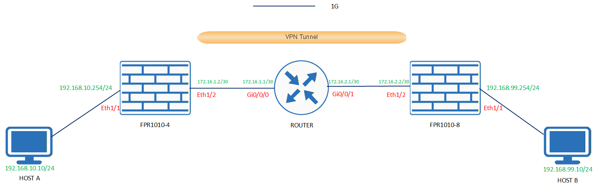
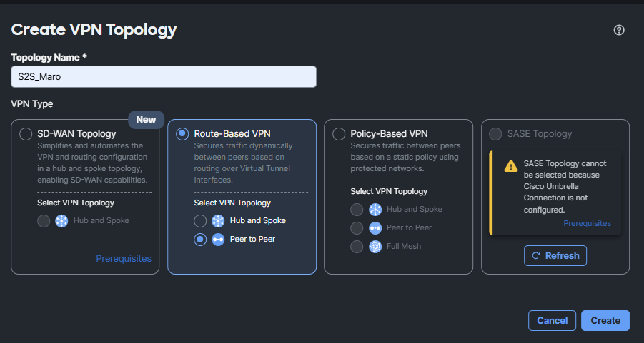
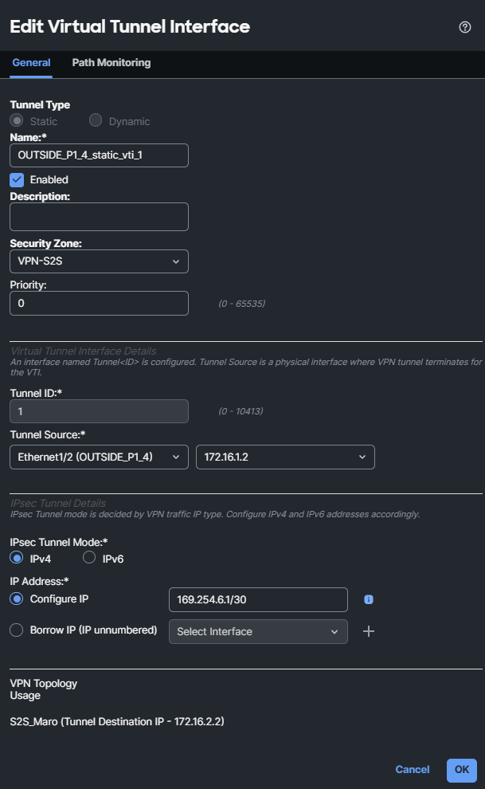
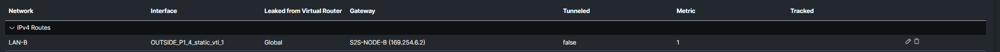
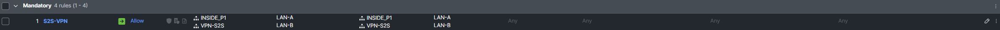
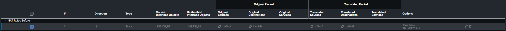
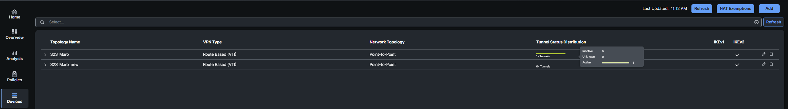
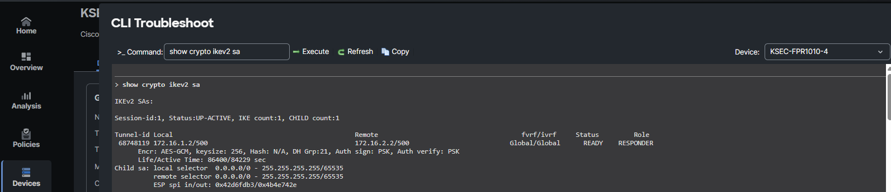
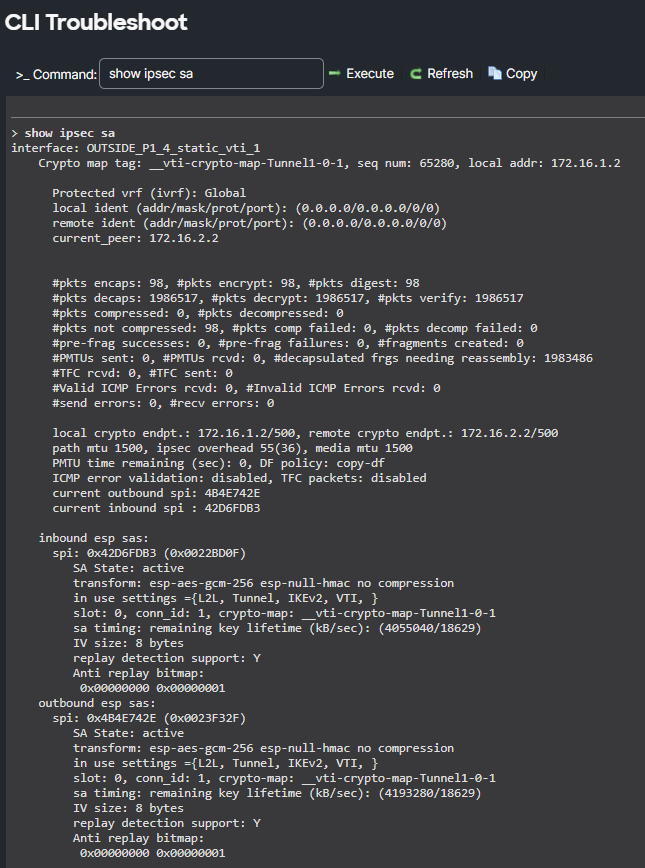
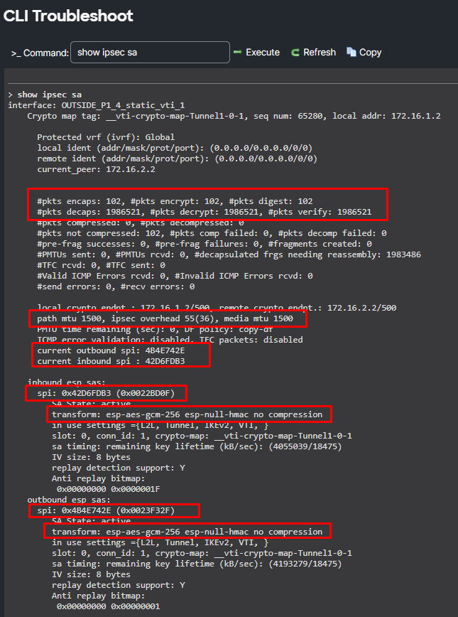

# 🛠️ LAB: Site-to-Site IKEv2 VPN with VTI (Cisco FMC)

In this lab, we will configure a Site-to-Site (S2S) IPsec VPN using **IKEv2** and **VTI (Virtual Tunnel Interfaces)** on Cisco Firepower managed by FMC.

### 🗺️ The Topology

  

We are using an **AES-GCM** proposal for this IPsec tunnel. This is crucial because AES-GCM significantly reduces header overhead (from the traditional 72 bytes down to just 55 bytes). It is an absolute game-changer for performance and MTU management.

---

### ⚙️ Step-by-Step FMC Configuration

Creating this VPN from the FMC GUI is relatively straightforward. Navigate to **Devices > VPN > Site to Site**. 
As seen below, we select an IKEv2 VPN based on VTI interfaces:

  

#### 1. Selecting the Devices (Endpoints)
First, we select the two Firepower devices that will terminate the VPN tunnel.

  

#### 2. Creating Virtual Tunnel Interfaces (VTI)
Next, we create the virtual interfaces, map them to the physical external interfaces, and assign them IP addresses.

  

> **💡 Pro-Tip: APIPA Addresses**
> We assign APIPA addresses (e.g., `169.254.x.x`) to the tunnel interfaces because we can be 100% sure they will never conflict with any LAN subnets in our company. It is the safest and most standard practice for point-to-point tunnels.

**Understanding the Advanced Options:**
*   **Tunnel source IP:** If your FPRs are behind a NAT device (e.g., they have private IPs like `192.168.1.1` on their outside interfaces), checking this box triggers the famous **NAT-T**. It encapsulates the ESP packets into UDP port 4500 so they can traverse the upstream PAT router.
*   **Send local identity to peers:** This is a lifesaver when you have dynamic IPs (LTE/DSL) or are behind NAT. Instead of saying *"Hi, I am IP 80.x.x.x"*, the branch firewall says *"Hi, I am Branch-Krakow"*. The HQ checks its database: *"Ah, I know Branch-Krakow, the password matches, let them in!"*. It acts like an ID card with a name instead of a home address.
    *   *Who uses this?* Retail stores, ATMs, construction sites, or small branches running on cheap internet (LTE/5G, Starlink). Buying a static public IP for 500 small shops is an astronomical cost. The tunnel can ONLY come up if the Branch "calls" the HQ (because the HQ doesn't know the Branch's IP today).
*   **Send Virtual Tunnel Interface IP to the peers:** You manually assign a VTI address (e.g., `169.254.6.1`) on your firewall. Checking this option simply makes your firewall tell its neighbor during negotiation: *"Listen man, if you want to send me any routing traffic, my address inside this pipe is 169.254.6.1"*.

#### 3. Static Routing
Since we are using VTI (Route-Based VPN), we must tell the firewall how to reach the remote LAN. We simply point a static route for the remote subnet out the newly created Tunnel interface.

  

#### 4. Access Control Policy (ACP)
We must explicitly allow traffic to and from the VPN zone. 
*Important:* Remember that besides allowing traffic from LAN-A to LAN-B, we must also allow traffic to the "Next Hop" interfaces. We do this by including the `VPN-ZONE` (which contains our VTI interfaces) in the ACP rules.

  

#### 5. NAT (NAT Exempt / Identity NAT)
Do we need to put a mask on the traffic going from LAN-A to LAN-B? No! We want them to talk using their real private IPs. Normally, we should create a **NAT Exempt** (Identity NAT) rule.

  

**Wait, look closely at the screenshot!** 
In our case, the NAT Exempt rule is grayed out (disabled). Yet, the VPN works perfectly fine! Why? 
Think back to the **Order of Operations**. According to our routing table, traffic destined for LAN-B exits through the VTI interface, which belongs to the `VPN-ZONE`. 
Our standard Auto NAT (PAT to the internet) only triggers if the destination zone is `OUTSIDE`. Since the packet is routed to `VPN-ZONE`, it doesn't match the PAT rule, so no NAT occurs anyway! 

---

### 🔍 Verification & Troubleshooting

Always verify your configuration. The simplest test is a ping from Host A to Host B. But as engineers, we look deeper into the CLI.

**1. Check the VTI Interface Status:**

  

**2. Check the Tunnel Details:**

  

**3. Check the Overall IPsec Status:**

  

**4. Deep Dive into IPsec SA (Security Associations):**
This is where you find the most valuable troubleshooting information.

  

**What to look for in this output:**
*   **`pkts encaps` / `encrypt` / `decrypt`:** If you send 4 ping packets, you should see BOTH `encrypt` and `decrypt` counters increase by exactly 4 (4 requests encrypted and sent, 4 replies received and decrypted). 
    *   *Troubleshooting Tip:* If `encrypt` increases by 4 but `decrypt` stays at 0, it means your traffic is successfully leaving the firewall, but the return traffic is being dropped somewhere along the path or by the remote peer!
*   **MTU:** You can verify the physical MTU and the calculated IPsec Tunnel MTU.
*   **SPI:** You can see the unique Security Parameter Index numbers for the inbound and outbound tunnels.
*   **Transform Set:** You can verify exactly which ciphers (e.g., AES-GCM) were successfully negotiated for this specific child tunnel.