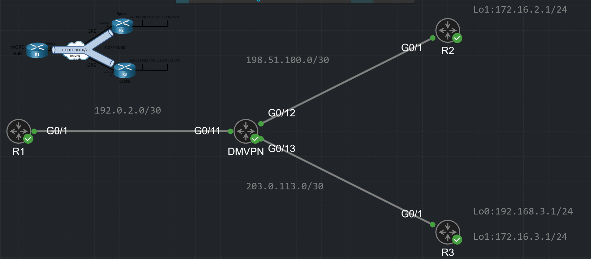

# 🕸️ DMVPN Phase 2: Spoke-to-Spoke Direct Tunnels

### 🗺️ The Topology

  

The ultimate goal of **DMVPN Phase 2** is to allow Spokes (e.g., R2 and R3) to communicate directly with each other, bypassing the Hub for the actual data payload. 

However, it is crucial to note that **the very first packets will still flow through the Hub (R1)**. Why? Because Spoke R2 needs to ask the NHRP server (the Hub) for Spoke R3's public IP address. Once R2 gets the answer, it builds a dynamic, direct GRE tunnel to R3. 

*(Note: The NHRP mapping to the Hub is static and "never expires", but the dynamic Spoke-to-Spoke mappings will expire after a period of inactivity to save memory).*

### 📇 The NHRP Table in Action

Here is what the NHRP table looks like on Spoke R2 after it establishes a direct tunnel with Spoke R3:

<pre style="background-color: #000000; color: #00ff00; padding: 15px; font-size: 14px; border-radius: 8px; border: 1px solid #444; line-height: 1.2;">
R2# show ip nhrp
100.100.100.1/32 via 100.100.100.1
   Tunnel1 created 02:15:30, never expire 
   Type: static, Flags: used 
   NBMA address: 192.168.1.1 

100.100.100.3/32 via 100.100.100.3
   Tunnel1 created 00:00:45, expire 01:59:14
   Type: dynamic, Flags: router used 
   NBMA address: 192.168.3.1 
</pre>

While building this lab, I encountered several fascinating challenges that perfectly explain how DMVPN works under the hood.

---

### 🛑 Lab Gotcha #1: Loopbacks as Tunnel Sources

In many labs, you will see a Loopback interface (e.g., `192.168.1.1`) used as the `tunnel source`. Why use a private Loopback instead of the physical WAN interface?

1.  **Ultimate Stability:** A Loopback interface never goes down. If you bind the tunnel to a physical `GigabitEthernet` port and the cable flaps for 3 seconds, the interface goes `down`. The routing protocol immediately drops neighbor adjacencies and flushes routes. With a Loopback, the tunnel stays `up`, and the router simply finds an alternate physical path in its routing table.
2.  **The Public vs. Private Reality:** In a lab, we can use private IPs for the underlay. In the real world, ISP routers would immediately drop private IPs on the internet. To fix this, we would need to apply an IPsec armor with NAT-T (UDP 4500) to encapsulate the GRE traffic.

---

### 🛑 Lab Gotcha #2: The Recursive Routing Nightmare

When configuring the routing protocols, you must strictly separate the **Underlay** (the physical network/internet) from the **Overlay** (the VPN tunnels and corporate LANs). 

**My Mistake:** I accidentally advertised the physical WAN/Loopback subnets into the Overlay routing protocol. 

**What happens when you do this?**
You create a logical routing loop (Recursive Routing). 
1.  You want to ping R2's LAN (`172.16.3.1`) from R1.
2.  R1 checks NHRP and sees it needs to go to R2's physical IP (`192.168.3.1`).
3.  R1 checks the routing table for `192.168.3.1`. Because of my mistake, the Overlay routing protocol says: *"To reach 192.168.3.1, go through Tunnel1!"*
4.  R1 says: *"Okay, to put it in Tunnel1, I need to wrap it in GRE and send it to the physical IP... which is reachable via Tunnel1... which needs GRE... which needs the physical IP..."*
The router gets stuck in an infinite loop, the tunnel collapses, and the console screams with `%TUN-5-RECURDOWN` errors. 

> **💡 The Golden Rule:** NEVER advertise your Tunnel Source IP addresses into the routing protocol that is running *inside* the tunnel!

---

### ⚙️ Phase 1 to Phase 2: The Configuration Shift

To move from Phase 1 (Hub-and-Spoke) to Phase 2 (Spoke-to-Spoke), we must change the behavior of both the Hub and the Spokes.

#### 1. The Hub Configuration (R1)
We must apply three critical commands to the Hub's `Tunnel0` interface:

<pre style="background-color: #000000; color: #00ff00; padding: 15px; font-size: 14px; border-radius: 8px; border: 1px solid #444; line-height: 1.2;">
R1(config-if)# ip nhrp map multicast dynamic
R1(config-if)# no ip split-horizon eigrp 100
R1(config-if)# no ip next-hop-self eigrp 100
</pre>

*   **`ip nhrp map multicast dynamic`**: You cannot send broadcast/multicast over the internet. This command tells the Hub: *"Look at the NHRP table. Take the Multicast packet generated by EIGRP, make individual Unicast clones of it, and send a copy to every dynamically registered Spoke."*
*   **`no ip split-horizon eigrp`**: Disables the anti-gossip rule. It allows the Hub to receive a route from Spoke R2 and advertise it back out the *exact same* Tunnel interface to Spoke R3.
*   **`no ip next-hop-self eigrp`**: **(Crucial for Phase 2)** 
    *   *With Next-Hop-Self (Phase 1):* The Hub tells R2: *"To reach R3's LAN, send the packet TO ME."*
    *   *Without Next-Hop-Self (Phase 2):* The Hub tells R2: *"To reach R3's LAN, send the packet DIRECTLY TO R3's tunnel IP."*

#### 2. The Spoke Configuration (R2 & R3)
The Spokes must also be upgraded. They are no longer just point-to-point clients; they must be able to build dynamic tunnels to multiple peers.

<pre style="background-color: #000000; color: #00ff00; padding: 15px; font-size: 14px; border-radius: 8px; border: 1px solid #444; line-height: 1.2;">
R2(config-if)# no tunnel destination
R2(config-if)# tunnel mode gre multipoint
R2(config-router)# no eigrp stub connected
</pre>

*   **`no tunnel destination`**: We remove the hardcoded destination because the Spoke will now use NHRP to dynamically find destinations.
*   **`tunnel mode gre multipoint`**: The Spoke's interface is upgraded from a simple GRE tunnel to an **mGRE** (Multipoint GRE) interface.

---

### 🤯 Deep Dive: The EIGRP `stub` Mystery

Why do we absolutely HAVE TO remove `eigrp stub connected` from the Spokes in Phase 2? 
Many engineers think: *"Wait, R3 has its LAN connected directly. The 'connected' filter allows it to advertise its LAN to the Hub. So why remove the stub?"*

To understand this, we must look at the direction of the routing updates.

**Direction 1: Spoke (R3) to Hub (R1)**
You are right! If R3 is an EIGRP Stub, it will successfully send its `172.16.3.0/24` LAN route to the Hub because it is a *connected* route. The Hub happily adds it to its routing table.

**Direction 2: Hub (R1) to Spoke (R2) — THE PROBLEM! 🛑**
Now the Hub wants to advertise R3's LAN to Spoke R2. 
Because we configured `no ip next-hop-self` on the Hub, the Hub tries to tell R2: *"Hey R2, to reach 172.16.3.0/24, you must use R3 (100.100.100.3) as your Next-Hop."*

**This is where the EIGRP algorithm on the Hub gets a logic heart attack! 💥**
The Hub thinks:
1. *"I want to tell R2 to use R3 as a transit router (Next-Hop)."*
2. *"But wait... R3 just introduced itself to me as a STUB (a dead-end)!"*
3. *"The strict rules of EIGRP state: **NEVER use a STUB router as a transit router for any traffic!***"

**The Catastrophic Result:**
Because R3 introduced itself as a STUB, the Hub (R1) flat-out refuses to advertise a route to R2 that points to R3 as the Next-Hop. 
Since R2 never receives the route with R3's Next-Hop, R2 never asks NHRP for R3's public IP, and the direct Spoke-to-Spoke tunnel is never built. Phase 2 completely fails. 🐷

> **🎙️ The Ultimate Summary:**
> We remove `stub` from the Spokes in Phase 2 NOT because the Spokes can't send their own routes. We remove it so the Hub stops treating the Spokes as "dead ends". Once the stub is removed, the Hub happily tells R2: *"Hey, R3 is a fully-fledged transit router now. Go ahead and route your traffic directly through him!"*