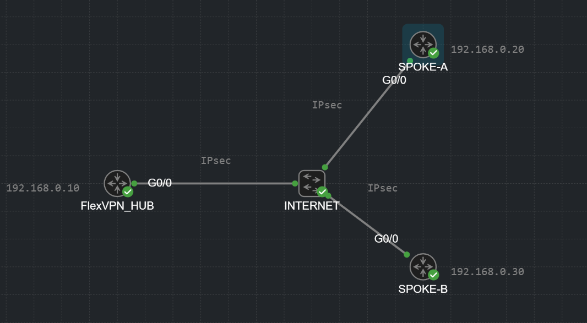

# 🌳 FlexVPN Hub: The Dependency Tree (How it all connects)

  

Configuring a FlexVPN Hub can look intimidating because the configuration is scattered all over the router. However, if you map it out visually, you realize it is just a brilliantly designed chain of dependencies. 

Here is the ultimate "Dependency Tree" of a FlexVPN Hub. Read it from the top (the physical interface) down to the roots (the cryptography).

<pre style="background-color: #000000; color: #00ff00; padding: 15px; font-size: 13px; border-radius: 8px; border: 1px solid #444; line-height: 1.2; overflow-x: auto; white-space: pre;">
                                         000000000000000000000000000000000000000000000000000000
                                    00000                                                      00000
                                00000                                                              00000
                             00000                                                                    00000
                          00000                                                                          00000
                       00000                                                                                00000
                     00000                                  interface loopback 1                                 00000
                   00000                             ip address 10.1.1.1 255.255.255.255                           00000
                 00000                                                |                                              00000
               00000                                                  v                                                00000
              00000                                interface virtual-template 1 type tunnel                             00000
             00000                                          ip unnumbered loopback1                                      00000
            00000                               tunnel protection ipsec profile FLEXVPN_PROFILE                           00000
           00000                                                      |                                                    00000
          00000                                                       v                                                     00000
         00000                                      crypto ipsec profile FLEXVPN_PROFILE                                     00000
         00000                                      set transform-set FLEXVPN_TRANSFORM                                      00000
         00000                                      set ikev2-profile FLEXVPN_PROFILE                                        00000
         00000                                               /                 \                                             00000
         00000                                              /                   \                                            00000
         00000                                             v                     v                                           00000
         00000     crypto ipsec transform-set FLEXVPN_TRANSFORM     crypto ikev2 profile FLEXVPN_PROFILE                 00000
         00000     esp-aes 256 esp-sha-hmac                         match identity remote address 0.0.0.0                00000
         00000     mode tunnel                                      authentication remote pre-share                      00000
         00000                                                      authentication local pre-share                       00000
         00000                                                      keyring local FLEXVPN_KEYRING                        00000
         00000                                                      aaa authorization group psk list FlexAuth HUBPolicy  00000
         00000                                                      virtual-template 1                                   00000
         00000                                                            /                   \                              00000
         00000                                                           /                     \                             00000
         00000                                                          v                       v                            00000
         00000                   crypto ikev2 keyring FLEXVPN_KEYRING    crypto ikev2 authorization policy HUBPolicy 00000
         00000                   peer FLEVPNPeers                        pool FlexPool                               00000
         00000                   address 0.0.0.0 0.0.0.0                 route set interface                         00000
         00000                   pre-shared-key local cisco123           route set access-list FlexTraffic           00000
          00000                  pre-shared-key remote cisco123                /                 \                   00000
           00000                                                              /                   \                  00000
            00000                                                            v                     v                 00000
             00000                                            ip local pool FlexPool       ip access-list standard   00000
              00000                                           10.1.1.2 10.1.1.254          permit 10.10.1.0 0.0.0.255 00000
               00000                                                                                                 00000
                 00000                                                                                             00000
                   00000                                                                                         00000
                     00000                                                                                     00000
                       00000                                                                                 00000
                          00000                                                                           00000
                             00000                                                                     00000
                                000000000000000000000000000000000000000000000000000000000000000000000000
                                                                     \        |        /
                                                                      \       |       /
                                                                       \      |      /
                                                                        |     |     |
                                                                        |     |     |
                                                                       /      |      \
                                                                      /       |       \
                                                                     |        |        |
                                                                     crypto ikev2 policy FLEXVPN_POLICY
                                                                     proposal FLEXVPN_PROPOSAL
                                                                             |
                                                                             v
                                                                     crypto ikev2 proposal FLEXVPN_PROPOSAL
                                                                     encryption aes-cbc-256
                                                                     integrity sha256
                                                                     group 14
                                                                          ___|___
                                                                         /       \
</pre>

---

### 🧠 Deep Dive: Explaining the Branches (Top to Bottom)

> **💡 Configuration vs. Explanation Note:**
> When you actually type the commands into the router, you build this tree from the **roots up** (you create the proposals, policies, and keyrings first, then attach them to the profiles, and finally apply them to the interface). If you tried to configure it top-down, the router would throw an error because the profiles wouldn't exist yet! 
> However, to make it easier to understand *how* it all logically connects, we will explain the branches below from the **top down** (from the interface down to the roots).

---

#### 1. The Interfaces & The "Cookie Cutter" (`Virtual-Template`)
We create a `Loopback1` interface with an IP address (e.g., `10.1.1.1`). We do this to lend its IP address "on the fly" to the Virtual Template using the command `ip unnumbered Loopback1`. 

Why? Because `Virtual-Template 1` is just a matrix. **A cookie cutter is not a cookie—you cannot eat it (you cannot send data through it).** That is why a Virtual-Template always has an `UP/DOWN` status. It just sits in the config waiting.
Every time a new Spoke connects, the router uses this cutter to stamp out a brand new, temporary interface called `Virtual-Access` (the actual cookie). Thanks to the `unnumbered` command, every cloned `Virtual-Access` interface borrows the exact same source IP from the Loopback.

#### 2. The Bridge (`ipsec profile` -> `ikev2 profile`)
The command `tunnel protection ipsec profile` glues the Phase 2 IPsec settings to the tunnel. But inside that IPsec profile, we have the command `set ikev2-profile`. 
This is the brilliant bridge! It hard-links Phase 2 directly to Phase 1. The router doesn't have to guess how to authenticate the peer; it follows the string directly to the IKEv2 profile.

#### 3. The IKEv2 Profile (Identity & Passwords)
This is the brain of the operation. 
*   **`virtual-template 1`**: This command tells the IKEv2 process: *"When a Spoke successfully authenticates using this profile, go grab Virtual-Template 1 and clone it for them."*
*   **`keyring`**: This points to the bag of passwords. 

> **🛡️ Security Pro-Tip: Asymmetric PSKs**
> In our basic lab, passwords might be the same. In reality, we use different passwords for each direction! 
> *   Hub uses `local cisco123` and `remote cisco321` (for Spoke 1).
> *   Spoke 1 uses `local cisco321` and `remote cisco123`.
> **Why?** If a hacker breaches one branch and steals the router, they only compromise that single branch's password. In the old IKEv1, one PSK ruled them all. Splitting this in FlexVPN drastically limits the blast radius of a breach!

#### 4. The Care Package (`authorization policy`)
This is where FlexVPN truly shines and destroys old DMVPN architectures. 
When a Spoke connects, the Hub can push a "Care Package" down the tunnel containing IP addresses and routes. This mechanism is officially called the **IKEv2 Configuration Payload** (using `CFG_REQUEST` and `CFG_REPLY` packets).

*   **`pool FlexPool`**: Gives the Spoke its Tunnel IP address.
*   **`route set access-list`**: Tells the Spoke: *"Here are the corporate LAN subnets you can reach through me."*
*   **`route set interface`**: Forces the Hub to tell the Spoke: *"Listen, my internal IP address on this tunnel (borrowed from Loopback1) is 10.1.1.1. Add it to your routing table as a /32 route."*

> **🚀 Performance Game-Changer:**
> Replacing heavy routing protocols (EIGRP/OSPF) with this IKEv2 Configuration Payload mechanism in a network with 1,000 branches saves up to **30-40% of CPU cycles** on the Hub! The router no longer has to maintain a thousand neighbor adjacencies and process Hello packets every 5 seconds. It just pushes the routes once during tunnel setup and forgets about it.

#### 5. The Global Crypto (`ikev2 policy` & `proposal`)
Notice that the Phase 1 crypto algorithms (AES, SHA, DH Group) are NOT glued to anything in this tree. 
They sit in the global configuration (The Roots). When a Spoke knocks on UDP port 500, the router scans its global policies from top to bottom until it finds a proposal that matches what the Spoke is offering.

#### 6. What about the Spokes?
You might be wondering how the Spoke configuration differs from this massive Hub tree. The good news is: **it doesn't differ much!** 

The primary difference is that on the Spoke, we **DO NOT** configure a `Virtual-Template`. Instead, we configure a standard, static `Tunnel` interface and set its IP to negotiation mode (`ip address negotiated`). This allows the Spoke to dynamically pull its Tunnel IP address and routing data (the Care Package) directly from the Hub's authorization policy during the IKEv2 handshake.