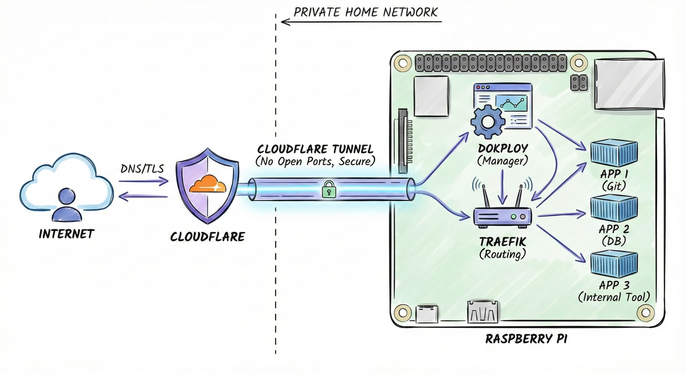

# ☁️ Cloudflare Tunnels: Bypassing NAT & Reverse Proxying

Cloudflare Tunnels are a fascinating and incredibly powerful solution for exposing internal services to the internet without compromising security or dealing with router configurations.

  

### 🔄 The Paradigm Shift: Outbound instead of Inbound

In a classic network setup, the internet knocks on your door (**Inbound traffic**). If you don't have port forwarding configured (or if you are behind a strict NAT/CGNAT), the firewall simply drops the traffic. 

Cloudflare flips this logic upside down:
1.  You install a lightweight agent (`cloudflared`) inside your local network.
2.  This agent constantly initiates **Outbound** connections to Cloudflare's edge servers. 
3.  Because it is outbound traffic, your local firewall allows it by default. It creates stateful NAT translations along the way, keeping the return path open.

**What does this give us?**
*   **Dynamic IPs don't matter:** If your public IP changes, the agent instantly reconnects and updates Cloudflare.
*   **Double NAT / CGNAT is bypassed:** Because the agent "drills" the hole from the inside out, you don't need a public IP on your router.
*   **Resilience:** The agent typically establishes **4 independent tunnels** using the modern **QUIC/UDP** protocol for high availability and speed.

---

### 🌍 Domains & Anycast Magic

To use this, you must own a domain and move its DNS management to Cloudflare. 

When an external client tries to connect to your service, their DNS query resolves to Cloudflare's global **Anycast Public IPs**, NOT your home/corporate IP! 

> **🛡️ Security Benefit:** 
> Your real public IP address is completely hidden from the internet. Attackers cannot DDoS your home router or scan your open ports because they only see Cloudflare's massive infrastructure. Cloudflare absorbs the attacks, and only clean, legitimate traffic flows down the tunnel to your agent.

---

### 🔀 The Agent as a Reverse Proxy

One crucial detail: the `cloudflared` agent doesn't just hold the tunnel open; it acts as a full-fledged **Reverse Proxy** inside your network.

In the Cloudflare dashboard, you map public subdomains to internal, private IP addresses and ports. When traffic comes down the tunnel, the agent looks at the requested subdomain and proxies the traffic to the correct local machine.

**Examples of Reverse Proxy Mapping:**
<pre style="background-color: #000000; color: #00ff00; padding: 15px; font-size: 14px; border-radius: 8px; border: 1px solid #444; line-height: 1.2;">
# Exposing an internal Web Server (HTTP)
cloud.yourdomain.com   ====>   http://10.62.145.23:8080

# Exposing a Windows Machine for Remote Desktop (RDP)
thor.yourdomain.com    ====>   rdp://10.62.145.34:3389

# Exposing an internal SSH Server
ssh.yourdomain.com     ====>   ssh://10.62.145.10:22
</pre>

By doing this, you can securely access dozens of internal services using beautiful domain names, all through a single outbound tunnel, without opening a single inbound port on your firewall!