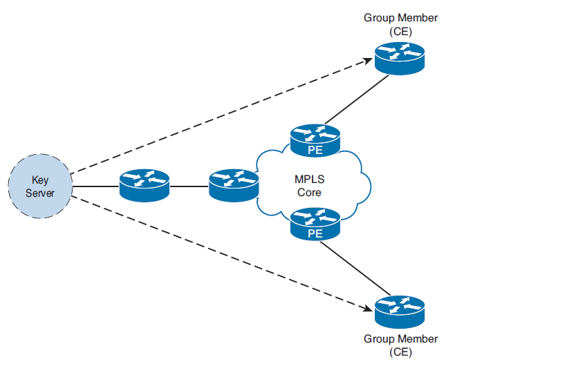
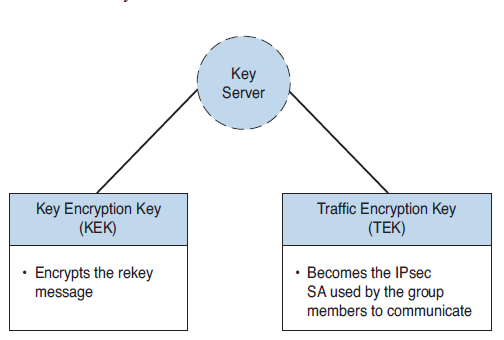

# 🛡️ GET-VPN: The Tunnel-less VPN (MPLS Encryption)

**GET-VPN (Group Encrypted Transport VPN)** was developed by Cisco. In short: Cisco took the old, traditional IPsec, stripped it down to its bare components, threw away what wasn't needed, and added their own brilliant features.

### 🌍 Where do we use it? (Not on the public internet!)
GET-VPN is **NOT** used on the "dirty", public internet. It was created specifically for private WAN networks, such as **MPLS** provided by an ISP. 
An MPLS network already knows how to route traffic between all our corporate branches. We don't need to build tunnels to find each other. GET-VPN simply adds encryption to the data payload while keeping the original private IP addresses completely intact.

---

### 🚀 The "Tunnel-less" Magic & QoS

The biggest advantage of GET-VPN is that it is **tunnel-less** (no encapsulation). It does not add any external IP headers. 

Why is this a game-changer? **QoS (Quality of Service)!**
In standard IPsec (Tunnel Mode), the router hides the original packet inside a new ESP envelope. The ISP's routers only see ESP traffic and cannot distinguish a VoIP phone call from a Windows Update download. 
Because GET-VPN doesn't use a tunnel, the original IP header (with its DSCP/QoS markings) remains fully visible to the ISP. The ISP can prioritize our voice traffic perfectly, while the data payload remains securely encrypted.

---

### 🧬 Cisco's Secret Sauce (The 4 Upgrades to IPsec)

To make this work, Cisco added several proprietary features to the standard IPsec framework:

1.  **GDOI (Group Domain of Interpretation):** An extension to the ISAKMP protocol. Instead of negotiating keys point-to-point (Router A to Router B), GDOI allows a "Boss" router to distribute the exact same encryption key to an entire group of routers.
2.  **Tunnel-less Architecture:** As mentioned, no extra IP headers.
3.  **TBAR (Time-Based Anti-Replay):** 
    *   *The Problem:* Standard IPsec uses sequential numbers (1, 2, 3...) to prevent hackers from recording a packet and replaying it later. In a group of 500 routers, sequential numbers would instantly break because everyone is transmitting at once. 
    *   *The Solution:* TBAR uses a strict timestamp (a time window). If a hacker intercepts a packet and tries to inject it back into the network even a second too late, the receiving router looks at the timestamp and drops it.
4.  **Centralized Management:** Instead of writing complex Crypto ACLs on 500 branch routers, you write the ACL **once** on the central server. The branches simply download it.

---

### 🏛️ The GET-VPN Infrastructure

  

*   **Key Server (KS) - "The Boss":** This router is responsible ONLY for creating the encryption policy (the ACL) and generating the keys. **It does not encrypt or decrypt user data.** 
    *(Note: For redundancy, we configure **COOP KS** - Cooperative Key Servers, which act as "Deputy Bosses" if the main KS dies).*
*   **Group Members (GM):** These are the branch routers. They register with the Boss, download the keys, and do the actual heavy lifting (encrypting and decrypting the data).
*   **Provider Edge (PE) Routers:** These belong to the ISP. They are not part of the GET-VPN cryptographic domain; they simply route the packets.

---

### 🔑 The Two Types of Keys

Since everything is group-based, the Key Server uses two different keys to manage the environment:

  

1.  **TEK (Traffic Encryption Key):** This is the actual AES key used by the Group Members to encrypt user data (emails, video, voice) flowing between the branches.
2.  **KEK (Key Encryption Key):** This is the administrative key. The Boss uses the KEK to encrypt the control-plane messages (like sending out a new TEK before the old one expires) to all Group Members simultaneously.

---

### ⚙️ The Registration Process (How a GM joins)

1.  The Group Member (GM) initiates a secure IKE Phase 1 channel to the Key Server (using a PSK or Certificate) and provides its **Group ID**.
2.  The Key Server verifies the password/cert.
3.  Instead of negotiating Phase 2, the Key Server simply pushes the IPsec SA, the Crypto ACL, the TEK, and the KEK down to the Group Member.
4.  **Configuration Note:** On the GM, you still configure a Crypto Map and bind it to the physical interface, but **you do not configure an ACL in it**. You only configure the IKE policy to reach the Boss. The actual IPsec policy is downloaded dynamically!