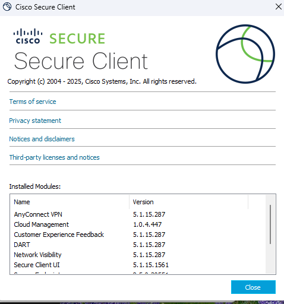

# 🛡️ Cisco Secure Client, Endpoint Protection & Zero Trust (ZTA)

To systematize our knowledge about modern endpoint protection, we must look at it not just as an "antivirus," but as a complete, multi-layered architecture. 

The architecture consists of several major components, starting with the software installed on the user's machine.

---

### 💻 1. The Endpoint Agent: Cisco Secure Client

Cisco Secure Client (formerly AnyConnect) is no longer just a VPN dialer. It is a unified agent that contains multiple security modules.

  

Here is a breakdown of its core modules:

*   **Secure Endpoint (formerly AMP for Endpoints):** The core Next-Generation Antivirus (NGAV) and Endpoint Detection and Response (EDR) engine.
*   **Posture Assessment:** Think of this as the "Bouncer at the gate". Even if a user enters the correct VPN password, the NAC server (Cisco ISE) places the device in an isolated quarantine VLAN. The Posture module checks if the device is compliant (e.g., *Is the AV running? Are virus definitions updated? Is the disk encrypted? Is Windows fully patched?*). Only if the device is 100% compliant does ISE grant full network access.
*   **AnyConnect VPN:** The classic remote access module (IPsec IKEv2 / SSL DTLS).
*   **DART (Diagnostics and Reporting Tool):** Collects deep diagnostic logs for TAC support.
*   **Network Visibility Module (NVM):** Because this module sits deep within the OS, it sees everything. It doesn't just see IPs and ports; it sees *processes*. It can send telemetry to a central brain (like Secure Network Analytics / Stealthwatch) saying: *"User John Doe just launched `powershell.exe` from a hidden temporary folder and connected to a Russian IP."*
*   **Umbrella (DNS-Layer Security):** This module installs a low-level kernel driver. It doesn't matter if the user manually changes their DNS to `8.8.8.8`. The Umbrella driver catches the DNS query "on the fly," encrypts it, and sends it to the Umbrella cloud. If a user in a hotel clicks a phishing link (`fake-bank.com`), Umbrella checks the domain's reputation and returns the IP of a safe block-page instead of the hacker's server. The attack is killed before a TCP connection is even attempted!
*   **Cloud Management:** Historically, the client only updated when connected to the corporate VPN. If a user worked exclusively on cloud apps (Office 365) for months, their agent became outdated. This module silently connects to the Cisco cloud in the background, checks for updates, and patches the agent seamlessly without requiring a VPN connection.

---

### 🚪 2. The Paradigm Shift: Classic VPN vs. Zero Trust Access (ZTA)

The industry is rapidly moving away from classic VPNs towards **Zero Trust Access (ZTA)** (often branded as Cisco Secure Access). Let's explain why using an example: We want to connect to a corporate accounting app (e.g., Comarch Optima).

**Scenario A: The Classic VPN (The Castle and Moat)**
The user connects via VPN. They are now inside the corporate network where the Optima server resides. However, the Secure Client failed to detect a brand-new, zero-day worm on the user's laptop. Because the laptop is on the VPN, the worm starts scanning the entire corporate subnet, looking for open ports and vulnerabilities. It runs rampant across the entire network.

**Scenario B: Zero Trust Access (ZTA)**
The Secure Client has a ZTA module deeply embedded in the OS. 
1.  The module connects to a Public Cisco Cloud (the **ZTA Edge**). 
2.  The Edge sends the client a specific list of allowed corporate domains. 
3.  The Edge constantly enforces MFA and Posture checks. It can cut off the endpoint at any millisecond.
4.  The user opens the Optima app. The ZTA module checks its list. Since Optima is on the list, it creates a **micro-tunnel exclusively for that single application/domain**. 
5.  *The Magic:* If the undetected worm wakes up and tries to scan other IPs or ports on the corporate network, the ZTA module simply **chops its head off** 🪓. The worm has no route to the corporate network because only the Optima app gets a micro-tunnel. The corporate network remains 100% safe!

> **🏗️ ZTA Architecture (How does the Edge reach the Server?)**
> The Endpoint connects to the Public ZTA Edge (acting as a Proxy). But corporate firewalls block inbound traffic! How does the Edge talk to the internal Optima server? 
> We deploy a lightweight **Connector** VM next to the Optima server. This Connector initiates an *outbound* connection to the ZTA Edge. Since firewalls allow outbound traffic, the tunnel stays open permanently. The Cloud simply stitches the Endpoint's tunnel and the Connector's tunnel together. *(This is the exact same brilliant architecture as Cloudflare Tunnels!)*

---

### ☁️ 3. Secure Endpoint Console (Cloud Management)

The Secure Endpoint Console (formerly AMP Console) is the cloud brain. The endpoint module is lightweight because the heavy database of malware hashes lives in the cloud. 

The configuration hierarchy flows like this:
<pre style="background-color: #000000; color: #00ff00; padding: 15px; font-size: 14px; border-radius: 8px; border: 1px solid #444; line-height: 1.2; overflow-x: auto;">
[ 1. OUTBREAK CONTROL ] ---> [ 2. MANAGEMENT (Exclusions) ] ---> [ 3. POLICY ] ---> [ 4. GROUP ]
</pre>

#### 🔬 Outbreak Control (The Blacklists)
*   **Custom Detection (Simple):** Blocking specific file hashes (SHA-256).
*   **Custom Detection (Advanced):** Acts more like a traditional AV using the ClamAV engine. This is crucial because malware creators use *polymorphism* (slightly altering the code to change the main SHA-256 hash). Advanced detection looks for constant, malicious patterns *inside* the file.
*   **Android:** Due to mobile OS specifics, this is a separate tab. You upload `.apk` files or select from inventory. *Note:* You cannot actively block malware installation on Android; you can only send alerts about threats or unwanted apps.
*   **Application Control:** Whitelisting or Blacklisting apps by hash.
*   **Network (IP Block/Allow):** Combined with Device Flow Correlation (DFC), this flags and blocks communication to specific malicious IPs or ports.
*   **Endpoint IOC (Indicators of Compromise):** IOCs are digital footprints or evidence that a machine has been breached. It is not the virus signature itself, but the *results* of its actions. 
    *   *Examples:* A strange new Windows Registry key (ensuring malware persistence), a weirdly named `.dll` in `C:\Windows\System32\`, or an active connection to a known Command & Control (C&C) server.

#### 🚫 Management (Exclusion Sets)
You must configure exclusions so the Endpoint agent doesn't scan unnecessary things and kill the CPU. For example, you exclude massive database files, or the directories of another legacy Antivirus running on the same machine. You can exclude by:
*   Specific Name or Extension
*   Wildcard (e.g., everything under `C:\Program Files\App\*`)
*   Exact Path

---

### ⚙️ 4. The Secure Endpoint Engines

Secure Endpoint uses multiple engines simultaneously:
1.  **TETRA:** A traditional, offline Antivirus engine (disabled by default to save resources).
2.  **SPERO:** Acts proactively based on active heuristics and Machine Learning. It doesn't look for a specific hash match; it analyzes the *behavior* of the file over time.
3.  **ETHOS (Fuzzy Fingerprinting):** If a hacker changes 1% of the malicious code to evade standard hash detection, ETHOS's "fuzzy" logic will still recognize the overall malicious structure and block it.

---

### 📱 5. Mobile Devices & MDM Integration

Why can't we just install Secure Endpoint on an iPhone or Android and block viruses?
Mobile operating systems (iOS/Android) are heavily "Sandboxed". Every app lives in its own impenetrable bubble. Even if you install a security agent, the OS strictly forbids it from looking into the folders of other apps.

**The Solution: MDM (Mobile Device Management)**
Phones have native MDM clients built into their core OS. When you install a management profile, you activate this client and point it to an MDM server (like **Cisco Meraki Systems Manager** in the cloud). 
Meraki SM acts as the central brain with deep OS privileges. Meraki then connects via API to the Secure Endpoint console, allowing you to view beautiful, unified security reports for mobile devices despite the sandbox limitations!

---

### 👁️‍🗨️ 6. Cisco XDR (Extended Detection and Response)

XDR is the ultimate cloud dashboard, primarily designed for SOC (Security Operations Center) analysts. It connects all Cisco security tools via APIs into a single pane of glass: Secure Endpoint, Secure Malware Analytics (formerly Threat Grid), Umbrella, Email Security, NGFW, and NGIPS. 
While it mostly operates in "read mode" to correlate alerts, you can use it to execute active responses, such as clicking a button in XDR to instantly block a malicious IP across all your firewalls and endpoints globally.