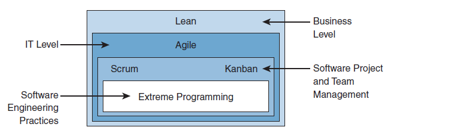

# 🔄 The Evolution of Software & Infrastructure Development

To understand modern IT environments, we must look at how the methodology of delivering software and infrastructure has evolved over the years.

---

### 🌊 1. Waterfall Model (The Legacy Approach)

*   **How it works:** A linear, rigid, and sequential process (Requirements ➔ Design ➔ Coding ➔ Testing ➔ Deployment). You cannot start the next phase without fully completing the previous one.
*   **The Flaws:** Requirements are "frozen" at the very beginning. Testing happens at the very end. If a critical architectural flaw is discovered during the testing phase, the cost of fixing it is astronomical.
*   **Modern Use Cases:** Today, it is mostly used only in physical engineering projects (e.g., building a Data Center, laying fiber-optic cables) or in rigid public/government tenders.

### 🏃‍♂️ 2. Agile (The Modern Approach)

*   **How it works:** Iterative work (working in small cycles). Instead of trying to deliver everything at once, the project is sliced into small, manageable pieces.
*   **Key Features:** Flexibility (requirements can change mid-flight), continuous collaboration with the client, and rapid, continuous testing.
*   **Origin:** Agile derives heavily from the **Lean Management** philosophy (created by Toyota in the 1980s), whose primary goal is the absolute elimination of waste (both time and resources).

---

### 🏗️ 3. Agile Frameworks (Putting Agile into Practice)

Agile is just a philosophy. To actually implement it, teams use specific frameworks:

*   **Scrum:** The most popular framework. Work is divided into **Sprints** (rigid timeframes, e.g., 2 weeks). The team pulls tasks from the **Backlog** (a prioritized list of requirements). Key elements include Daily Stand-ups and Retrospectives (focusing on continuous improvement after each Sprint).
*   **Kanban:** Focuses on workflow fluidity and visualization (using a board: *To Do ➔ In Progress ➔ Done*). It relies heavily on the **Just-in-Time (JIT)** principle and strictly limiting Work-In-Progress (WIP) to avoid bottlenecks. It is perfect for handling daily, unpredictable tasks like SOC incident response or vulnerability patching.
*   **Extreme Programming (XP):** Focuses on extreme code quality and very frequent, tiny releases. This allows for immediate verification and feedback from the client.

---

  

### 🤝 4. DevOps: Breaking Down the "Silos"

DevOps is not a tool or a specific software; **it is a work culture**. It merges departments that historically fought and blamed each other into one collaborative value stream: 
`Management ➔ Dev (Developers) ➔ QA (Testers) ➔ Ops (Admins/Network Engineers) ➔ Security`.

#### The Foundation of DevOps: The CAMS Model
Every successful DevOps organization must be built on 4 pillars:
*   **C - Culture:** A shift in mentality. Collaboration instead of finger-pointing. Actions must be **Business Driven** (technology must deliver tangible business value, not just be "art for art's sake").
*   **A - Automation:** Replacing manual clicking with scripts (Infrastructure as Code). This massively increases speed and eliminates human error.
*   **M - Measurement:** Collecting telemetry and logs. Everything must be measurable so you know exactly what needs optimization.
*   **S - Sharing:** Teams share knowledge, tools, and responsibility for success or failure (*Shared Fate*).

---

### 🛣️ 5. The Three Ways of DevOps

These are the absolute core principles of operating in a DevOps environment. Think of them as a cohesive system of connected vessels:

1.  **The First Way (Flow - Left to Right):** You build a fast "highway" from idea to production. Code flows quickly in small *batch sizes*. Instead of deploying 100 massive changes once a year, you deploy 1 tiny change every single day.
2.  **The Second Way (Feedback Loop - Right to Left):** Since code travels so fast, you need "radars" (monitoring, alerts) on this highway. When an accident happens (a bug in production), the signal immediately travels back to the engineers before the client even notices.
3.  **The Third Way (Continuous Learning):** Engineers receive this signal, analyze the crash, and experiment on how to improve the highway so that the exact same accident never happens again.

---

### ⚙️ 6. CI/CD: The DevOps Assembly Line

The ultimate IT tool that physically realizes these "Three Ways" is the **CI/CD Pipeline**. It acts as an advanced, automated assembly line for DevOps.

*   **CI (Continuous Integration):** 
    An engineer writes code (e.g., changing a security policy) and pushes it to a Git repository. The system automatically builds and tests it. This allows for the instant detection of errors. If you make a typo, the CI system catches it immediately.
*   **CD (Continuous Delivery / Deployment):** 
    If the tests pass successfully, the system automatically deploys the code. For example, it pushes the new configuration to AWS, Cisco FMC, etc.
    *(Note: This provides full visibility. Every pipeline execution is logged, so we always know exactly who pushed which change).*

#### 🌐 Real-World NetDevOps Scenario: Automating Cisco FTD

Let's trace a modern Infrastructure as Code (IaC) scenario. We want to add a new firewall rule to our FTDs (managed by FMC). Instead of clicking through the GUI, we use CI/CD.

**The Tools:** GitLab (Repo & CI/CD engine) + Ansible or Terraform (Automation tool).

1.  **The Engineer's Move (Initiation):** We write the configuration in a text file (YAML/Ansible), defining our new rule. We execute a `git push`, sending the code to GitLab.
2.  **The CI Phase (Testing):** GitLab automatically detects the new code (the trigger). It spins up a small virtual machine or container (a *Runner*) which executes predefined checking scripts:
    *   *Syntax Checker:* Is the YAML formatted correctly?
    *   *Security Test:* Does this rule violate company policy?
    *   *Dry-Run:* The API connects to the FMC and performs a simulation in read-only mode.
3.  **The CD Phase (Deployment):** If all tests return a green light, GitLab runs Ansible in "live" mode. Ansible connects to the FMC API and injects the configuration.
4.  **The Result:** The rule is live on the network, and an automated message pops up in the team's Webex channel: *"New firewall rule deployed to production at 14:00."*

---

### 🛡️ 7. Security Testing in CI/CD Pipelines

To ensure code and infrastructure are safe before deployment, engineers integrate automated security scanners into the CI/CD pipeline:

*   **Fuzzing (Fuzz Testing):** 
    This involves bombarding an application or network device with a massive amount of random, corrupted, or giant data. The goal is to see if the program crashes or leaks memory. Programs used for this are called *fuzzers* (e.g., Peach, American Fuzzy Lop, Synopsys Defensics).
    > *Cisco Note:* Cisco created its own fuzzer called **Munity**, which utilizes a tool called *Radamsa* to generate specific data mutations.
*   **SAST (Static Application Security Testing):** 
    A "white-box" scanner. It reads the raw *source code* looking for stupid mistakes, hardcoded passwords, or vulnerabilities *before* the application is even compiled or run. (Examples: SonarQube, FindBugs for Java).
*   **DAST (Dynamic Application Security Testing):** 
    A "black-box" scanner. It attacks a *running* application (e.g., a live website) from the outside, trying to inject SQLi or XSS payloads to see if the app is vulnerable in a real-world scenario.