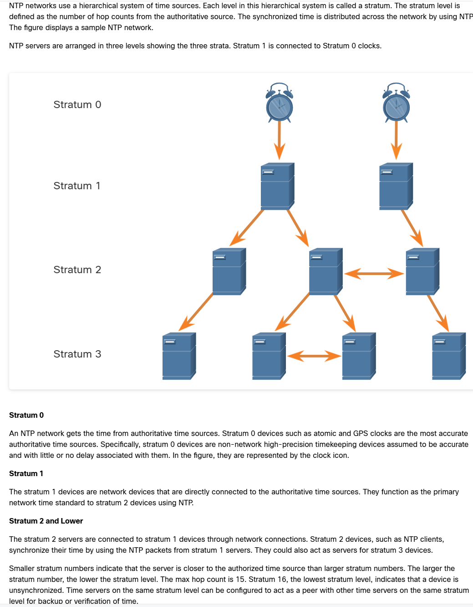
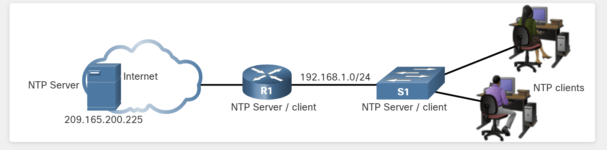
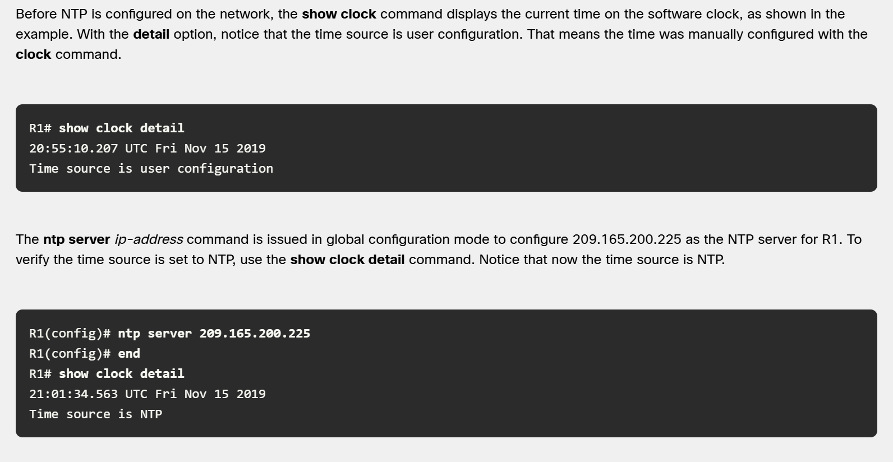
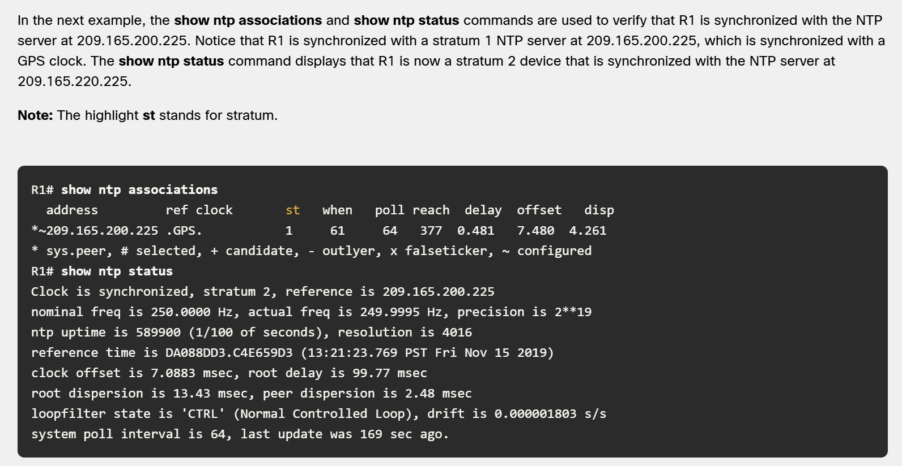
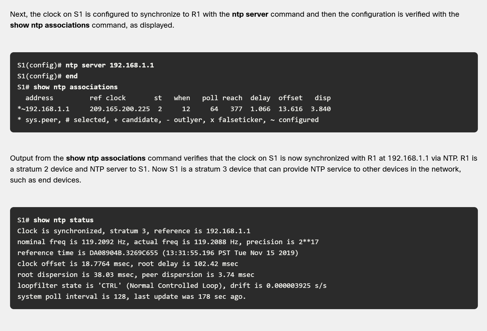

NTP operates on 123 UDP port

it is based on the hierarchical system like below:

  

Keep in mind that even if we save the time to NVRAM using the clock set command, the clock will reset after a reboot. This is because the system reads the time from the motherboard battery. Sometimes, the device doesn't even have one. However, there are commands to synchronize this battery with the system time

Najlepiej ustawic serwer NTP

Ponizej przydatne komendy:

  

  

  

  

