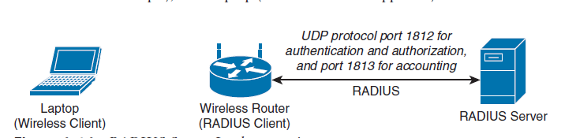
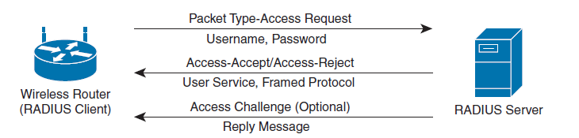
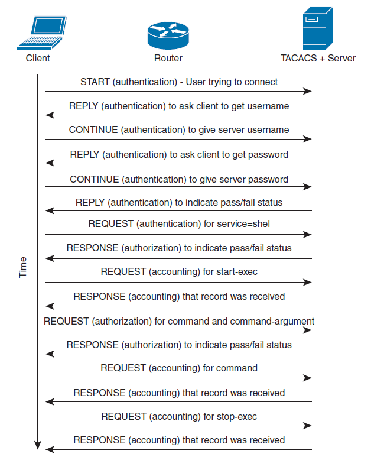

# 🔐 AAA Protocols: RADIUS vs. TACACS+ Deep Dive

When implementing AAA (Authentication, Authorization, and Accounting) in a network, we rely on two primary protocols: **RADIUS** and **TACACS+**. While they serve similar purposes, their architecture and behavior are fundamentally different.

---

## 🔵 1. RADIUS (Remote Authentication Dial-In User Service)

RADIUS uses a classic Client-Server architecture. In this context, the network device (e.g., a switch or firewall) acts as the Client and is officially called the **Access-Server** (or NAS - Network Access Server).

  

*   **Transport:** Operates over **UDP**.
*   **Ports:** `1812` for Authentication/Authorization, and `1813` for Accounting. *(Note: Legacy implementations used ports `1645` and `1646`).*
*   **Architecture:** It combines Authentication and Authorization into a single process.

### 🛠️ The Lifesaver: Attribute 26 (VSA)
RADIUS is an old standard with strictly defined fields. However, it contains a protocol extension mechanism. 

**Attribute 26** is the **VSA (Vendor-Specific Attribute)**. This attribute is the sole reason RADIUS didn't die of old age. It allows every vendor (Cisco, Palo Alto, Fortinet) to smuggle their own proprietary commands and privileges (e.g., assigning a specific dACL or firewall role) without breaking the global RADIUS standard.
Inside Attribute 26, you will find:
*   **Vendor ID:** e.g., Cisco is `9`.
*   **Payload:** e.g., *"Apply this specific Downloadable ACL"*.
*(If a Juniper switch receives a RADIUS packet containing a Cisco VSA, it simply ignores that specific attribute and processes the rest).*

### 🔄 The RADIUS Exchange Process

Authentication and Authorization consist of two main phases:

1.  The Access-Server sends an **`Access-Request`** to the RADIUS server. This contains the user's identity, password, and other info (like the NAS IP).
2.  The RADIUS server processes this and can reply in one of three ways:

  

*   **`Access-Accept`:** Authentication is successful. This packet also carries the authorization attributes (like VLAN assignment).
*   **`Access-Reject`:** Authentication failed (wrong password or user denied).
*   **`Access-Challenge`:** The server needs more information (e.g., prompting for an MFA token or a certificate). The Access-Server will then send another `Access-Request`.

**Accounting:**
Accounting is handled separately and uses two messages: **`Accounting-Request`** and **`Accounting-Response`**. It is primarily used for billing, auditing, and tracking exactly how long a user was logged in.

> **⚠️ Security Note:** 
> In RADIUS, **only the password field** inside the `Access-Request` is encrypted (using a hash of the shared secret). The rest of the payload (Username, IP addresses, AV-Pairs) is sent in **plain-text**!

---

## 🔴 2. TACACS+ (Terminal Access Controller Access-Control System Plus)

TACACS+ is a Cisco-proprietary protocol (though widely adopted). It shares the same Client-Server architecture but operates very differently under the hood.

*   **Transport:** Operates over **TCP**.
*   **Port:** `49`.
*   **Architecture:** It completely **separates** Authentication, Authorization, and Accounting into distinct, granular processes.
*   **Security:** TACACS+ **encrypts the entire payload** of the packet, making it much more secure for transmitting sensitive administrative commands.

### 🔄 The TACACS+ Exchange Process

Because TACACS+ separates the AAA functions, the packet exchange is more conversational.

**Authentication Exchange:**
Uses `START`, `REPLY`, and `CONTINUE` messages.
1.  The Access-Server initiates communication with a `START` message.
2.  The TACACS+ server responds with a `REPLY`, confirming the start and asking for the Username.
3.  The Access-Server sends a `CONTINUE` containing the Username.
4.  The TACACS+ server sends a `REPLY` asking for the Password.
5.  The Access-Server sends a `CONTINUE` containing the Password.
6.  The TACACS+ server sends a final `REPLY` indicating Pass or Fail.

  

**Authorization & Accounting Exchange:**
Once authenticated, Authorization and Accounting are handled using simple **`REQUEST`** and **`RESPONSE`** messages. 
Because Authorization is separate, TACACS+ allows for extreme granularity—you can authorize (or deny) *every single CLI command* an administrator tries to type on a router!