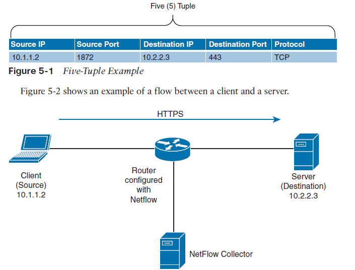
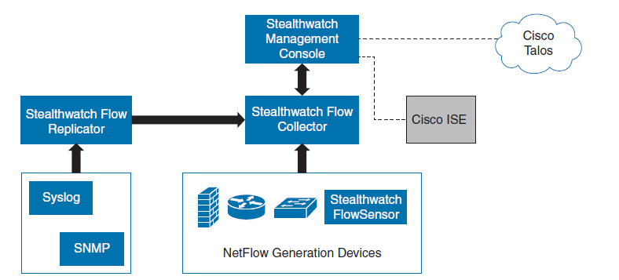

# 👁️‍🗨️ NetFlow, IPFIX & Cisco Secure Network Analytics (Stealthwatch)

To achieve true network visibility, **NetFlow** is the ultimate solution (acting as the *Sensor*). When combined with network segmentation tools like Cisco ISE and SGT tags (acting as the *Enforcer*), they create a highly effective, complementary security ecosystem.

### 🌊 The Basics: NetFlow v9, Flexible NetFlow & IPFIX

When we configure NetFlow on a router or switch, we are essentially generating "records" of network conversations. 

In its most minimal version, a flow is defined by the **5-Tuple** (Five-Tuple). For packets to be counted as a single, continuous flow, they must share the exact same 5 parameters:
1. Source IP Address
2. Destination IP Address
3. Source Port
4. Destination Port
5. Layer 4 Protocol (TCP/UDP)

  

*(Of course, with Flexible NetFlow, we can configure a wide array of other parameters to track).*

Both NetFlow and IPFIX simply push this traffic data to a collector. You must configure the destination IP and Port on the sending devices.
*   **IPFIX:** The open standard version of NetFlow. It can use **SCTP** (a Layer 4 protocol alongside TCP and UDP) for reliable delivery, but it also supports TCP and UDP on port **4739**.
*   **NetFlow:** Typically uses UDP ports **2055** or **9995**.

---

### 🏛️ Cisco Secure Network Analytics (Stealthwatch) Architecture

Cisco acquired a company called Lancope and evolved their product into what is now **Cisco Secure Network Analytics** (formerly Stealthwatch). It is a solution built entirely around the NetFlow protocol. It is used to gather data for various purposes, primarily security (detecting attacks and anomalies) and capacity planning (determining network saturation).

  

**The Core Components:**
*   **SMC (Stealthwatch Management Console):** The brain. It collects all the processed data and displays it on beautiful, actionable dashboards for analysts.
*   **FlowCollector:** The workhorse. It receives the raw NetFlow from the network, deduplicates it, and stitches it together. It has a very basic web interface just for setting its IP, NTP, etc.
*   **Flow Sensor:** Modern Cisco devices have NetFlow generation built-in. However, if you have legacy switches, or if you want extremely deep, high-fidelity telemetry (like ETA/SPLT), you deploy a dedicated Cisco Stealthwatch Sensor appliance to listen to the traffic.
*   **Flow Replicator (UDP Director):** An intelligent splitter. It is a highly efficient, dedicated machine. It receives a single massive stream of NetFlow data and duplicates/forwards it to multiple different systems (e.g., one copy to Stealthwatch, one copy to Splunk, one copy to SolarWinds).

---

### ☁️ Stealthwatch Cloud (SaaS)

We also have the option to monitor our network using Cisco Secure Network Analytics from the cloud. 

The requirement here is to deploy a **Stealthwatch Cloud Sensor** inside our local network. This is usually a lightweight Virtual Machine. It collects the local data, encrypts it, compresses it, and sends it securely to the Cisco Cloud. 
*The Benefit:* As an engineer, you don't have to worry about maintaining massive local databases or hardware. You just log into the cloud dashboard and have a ready-to-use solution.

As seen in the architecture diagram, this sensor can collect data in two ways:
1.  **Direct Traffic Inspection:** By connecting it to a switch port configured with SPAN (Port Mirroring) or a physical TAP device.
2.  **NetFlow/IPFIX Ingestion:** Network devices that already generate NetFlow simply send their logs directly to our local cloud sensor.

---

### 🕵️‍♂️ Threat Hunting & Capacity Planning

**Threat Hunting with Cisco Stealthwatch:** 
This is a proactive security concept based on the assumption that *the hacker is already inside our network*, and we must hunt them down before they cause damage. We use Stealthwatch and NetFlow logs to look for lateral movement, unusual data hoarding, or weird C2 (Command and Control) beaconing.

**⚠️ The Danger of NetFlow Overhead (FPS)**
It is absolutely critical to plan your NetFlow deployment carefully. Turning on full NetFlow everywhere at once without testing can literally kill your network bandwidth and crash your collectors. 

We measure this capacity using **FPS (Flows Per Second)**. This parameter tells us how many records the collector can receive and analyze.
*   Typically, a device with NetFlow enabled can generate between **1,000 to 5,000 FPS per 1 Gbps of data throughput**.
*   *Example 1 (Backups):* If you are running massive server backups, you might only see 1,000 FPS because it is one giant, continuous flow of traffic.
*   *Example 2 (Web Browsing):* When hundreds of users are opening different websites, loading ads, and making DNS queries, the FPS skyrockets because there are thousands of tiny, distinct flows.

> **💡 Engineering Pro-Tip:**
> It is highly recommended to use **Random-Sampled NetFlow** (e.g., capturing 1 out of every 100 packets) initially to test how much NetFlow will congest your network. Sampled NetFlow is great for *Traffic Engineering* and capacity planning. However, **it is useless for Threat Hunting**, because you might accidentally drop the exact packet that contains the hacker's exploit! For security, you need 1:1 unsampled NetFlow.