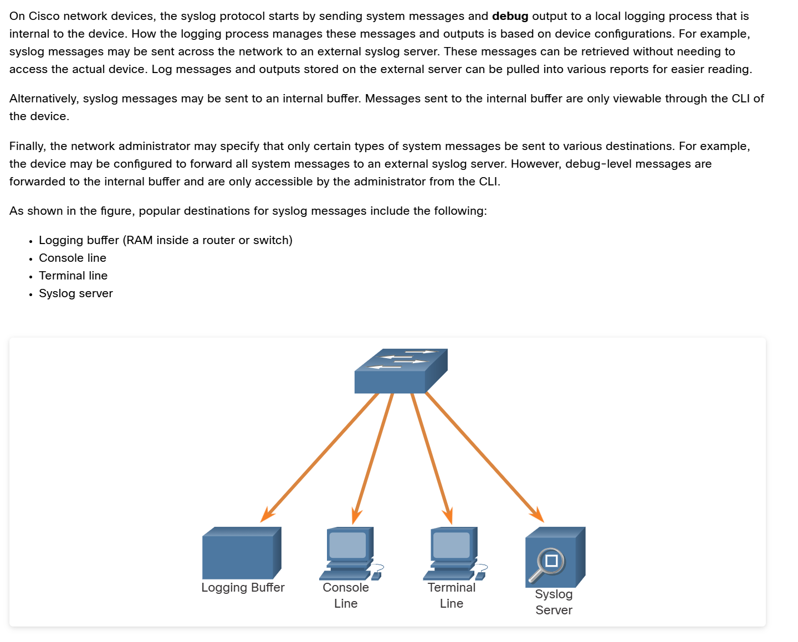

  

Syslog operates on port UDP 514 to sent event notification message across IP networks to event message collectors, as show in the figure

  

Dół do poprawy z tym wyjasnieniem

# 🚰 Logging vs. Debugging: The Plumbing Analogy

In Cisco networking, it is crucial to understand the fundamental difference between **Logging** and **Debugging**. To visualize this, imagine a plumbing network with a water pump, a main valve, and several faucets.

*   **Debugging (The Main Valve):** This is the *generation* of information. Turning it on increases the water pressure in the pipes.
*   **Logging (The Faucets):** This is the *displaying or storing* of information. Opening a faucet lets you see the water flowing.
*   **The CPU / Control Plane (The Water Pump):** The engine that drives the whole system.

By default, the device generates some basic information (like interface up/down events or hardware issues). So, there is always a baseline level of "water" in the pipes.

### 📊 The Plumbing Diagram

<pre style="background-color: #000000; color: #00ff00; padding: 15px; font-size: 14px; border-radius: 8px; border: 1px solid #444; line-height: 1.2;">
      [ CPU / CONTROL PLANE ] (The Water Pump)
                 |
                 v
          (MAIN VALVE) ===> DEBUGGING (Generates Data / Pressure)
                 |
========================================================= (The Pipes)
     |               |               |               |
  (Faucet)        (Faucet)        (Faucet)        (Faucet) ===> LOGGING 
     |               |               |               |          (Displays Data)
 [Console]       [SSH / VTY]     [Buffered RAM]  [Syslog Server]
</pre>

---

### ⚠️ The Danger Zone: CPU Overload

When you enable debugging, the pressure in the pipes increases. 
If you type `debug all`, you open the main valve completely. The pressure becomes so immense that the pipes burst, and the pump (CPU) crashes, locking up the device. 

**The "No Logging" Trap:**
Even if you close all the faucets (`no logging console`, `no logging monitor`), but leave the main valve open (`debug all`), the pump is still working at 100% capacity trying to push the water. **The device will still crash.** 

**Safety Best Practices:**
1. Never use `debug all`. Always use specific debugs (e.g., `debug crypto isakmp` or `debug ip ssh`).
2. Always have `undebug all` (or `u all`) ready to type.
3. Use Access Control Lists (ACLs) to limit debug output to specific IP addresses.
4. **Always log via SSH/VTY instead of the Console.** The physical console port is very slow (9600 baud). Sending massive amounts of text to the console will spike the CPU much faster than sending it over an SSH session.

---

### 🎚️ Syslog Severity Levels

When you open a "faucet" (enable logging), you can choose how much detail you want to see based on severity levels (0 to 7).

| Level | Name | Description | Example |
| :---: | :--- | :--- | :--- |
| **0** | Emergency | System is unusable. | Panic condition, hardware failure. |
| **1** | Alert | Immediate action needed. | Temperature limit exceeded. |
| **2** | Critical | Critical conditions. | Memory allocation failure. |
| **3** | Error | Error conditions. | Interface errors. |
| **4** | Warning | Warning conditions. | Configuration warnings. |
| **5** | Notification| Normal but significant condition. | Interface up/down, routing neighbor up/down. |
| **6** | Informational| Informational messages. | ACL matches, normal system events. |
| **7** | Debugging | Highly detailed diagnostic info. | Output generated by `debug` commands. |

*Mnemonic to remember: **E**very **A**wesome **C**isco **E**ngineer **W**ill **N**eed **I**cecream **D**aily.*

---

### 🛠️ Practical CLI Configuration

**1. Enabling Logging on an SSH Session (VTY)**
By default, if you SSH into a router and run a debug, you won't see anything. You must explicitly open the SSH "faucet":
<pre style="background-color: #000000; color: #00ff00; padding: 15px; font-size: 15px; border-radius: 8px; border: 1px solid #444; line-height: 1.2;">
Router# terminal monitor
Router# debug ip icmp
ICMP packet debugging is on
</pre>

**2. Terminal Customization Commands**
Here are useful commands to customize your terminal session for better troubleshooting:

*   **`terminal length 0`**
    Prevents the output from pausing with the `--More--` prompt. It displays the entire output at once (perfect for copying `show run`).
<pre style="background-color: #000000; color: #00ff00; padding: 15px; font-size: 15px; border-radius: 8px; border: 1px solid #444; line-height: 1.2;">
Router# terminal length 0
Router# show running-config
! (The entire config prints without stopping)
</pre>

*   **`terminal exec prompt timestamp`**
    Adds a real-time timestamp to every command you execute, which is incredibly useful for tracking when you made a change during an outage.
<pre style="background-color: #000000; color: #00ff00; padding: 15px; font-size: 15px; border-radius: 8px; border: 1px solid #444; line-height: 1.2;">
Router# terminal exec prompt timestamp
Load for five secs: 1%/0%; one minute: 1%; five minutes: 1%
Time source is hardware calendar, *14:32:15.123 UTC Wed Mar 11 2026
Router# 
</pre>