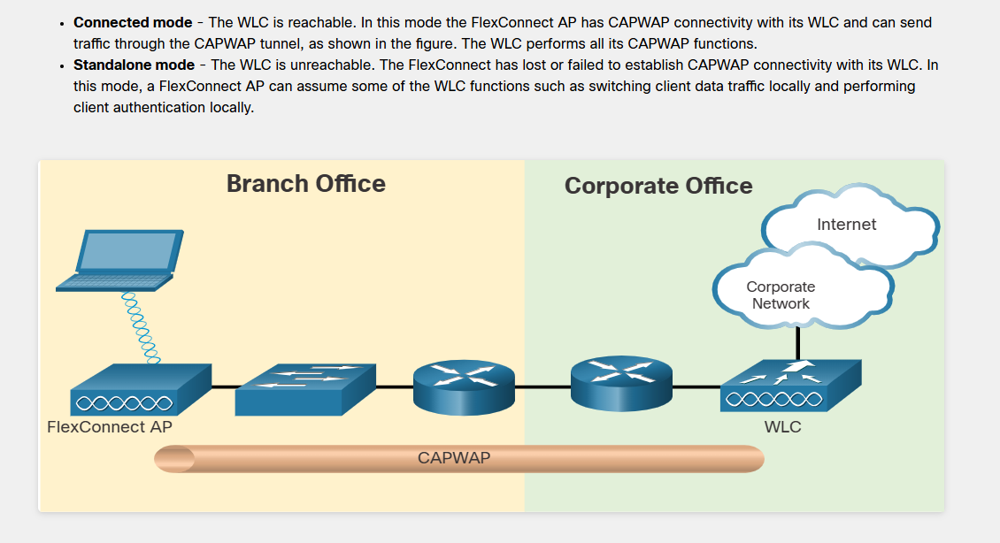
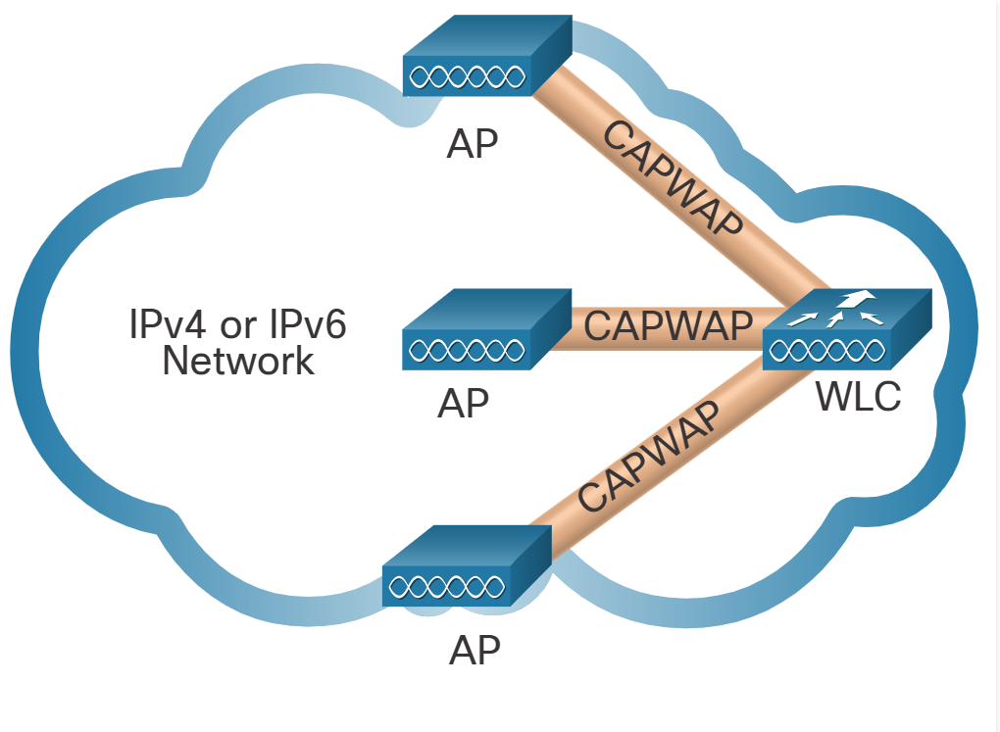
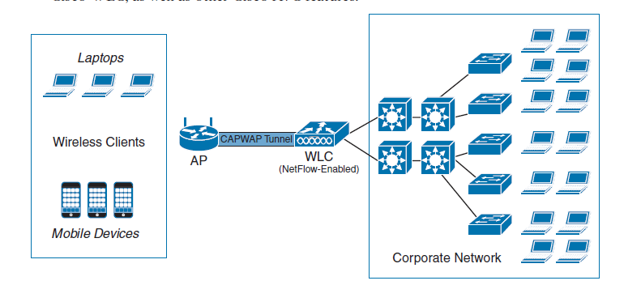

# 📶 Cisco Wireless Architecture: AP Modes, FlexConnect & CAPWAP

Before diving into the configuration of Wireless LAN Controllers (WLC), we must understand the fundamental architecture of Cisco Access Points (APs) and how traffic flows through the network.

### 🌳 The Access Point Hierarchy Tree

<pre style="background-color: #000000; color: #00ff00; padding: 15px; font-size: 13px; border-radius: 8px; border: 1px solid #444; line-height: 1.2; overflow-x: auto; white-space: pre;">
                                      000000000000000000000000000000000000000000000000000000000000
                                  00000                                                          00000
                               00000                                                                00000
                             00000                     [ ACCESS POINT (AP) MODES ]                    00000
                           00000                                    |                                   00000
                         00000               +----------------------+----------------------+              00000
                       00000                 |                                             |                00000
                     00000                   v                                             v                  00000
                   00000             [ AUTONOMOUS AP ]                             [ LIGHTWEIGHT AP ]           00000
                 00000          (Independent, self-managed)                   (Managed by WLC via CAPWAP)         00000
               00000                                                                       |                      00000
             00000                                          +------------------------------+----------------+       00000
            00000                                           |                                               |        00000
           00000                                            v                                               v         00000
          00000                                       [ LOCAL MODE ]                                [ FLEXCONNECT ]       00000
         00000                               (Default, WLC is on the same site)            (Branch office, WLC across WAN)  00000
        00000                                               |                                               |           00000
       00000                                       (Central Switching)                      +---------------+---------------+   00000
      00000                                                                                 |                               |    00000
     00000                                                                                  v                               v     00000
    00000                                                                            [ CONNECTED ]                   [ STANDALONE ]   00000
   00000                                                                       (WAN is UP, talks to WLC)       (WAN is DOWN, survives)00000
  00000                                                                                     |                               |       00000
 00000                                                                             (Local OR Central                 (Local Switching     00000
 00000                                                                                Switching)                          ONLY)       00000
  000000000000000000000000000000000000000000000000000000000000000000000000000000000000000000000000000000000000000000000000000000000000000
                                                                     \        |        /
                                                                      \       |       /
                                                                       \      |      /
                                                                        |     |     |
                                                                        |     |     |
</pre>

---

### 1️⃣ The Two Main Types of Access Points

*   **Autonomous AP:** These operate completely independently. Each AP has its own GUI/CLI, its own configuration, and manages its own security. (Used in very small setups or homes).
*   **Lightweight AP (LAP):** These have no "brain" of their own. They are entirely managed by a central **Wireless LAN Controller (WLC)**. 

### 2️⃣ Lightweight AP Operational Modes

When deploying Lightweight APs, you must choose their operational mode based on your network topology:

*   **Local Mode:** This is the default mode. It is used when the WLC and the APs are in the exact same physical location (e.g., the HQ building). 
*   **FlexConnect Mode:** This is used when the WLC is at the HQ, but the APs are located in a remote branch office across a WAN link. 

  

#### FlexConnect States (Surviving a WAN Outage)
In FlexConnect mode, the AP can be in one of two states:
*   **Connected:** Everything is fine. The AP can talk to the WLC at the HQ over the WAN.
*   **Standalone:** An excavator cuts the WAN cable! The AP loses contact with the WLC. Instead of shutting down, the AP enters "Standalone" mode. It keeps broadcasting the Wi-Fi network and authenticates users locally until the WAN is restored.

---

### 🔀 3️⃣ Traffic Flow: Central vs. Local Switching

Where does the actual user data (e.g., a YouTube video stream) go when a user connects to the Wi-Fi?

*   **Central Switching:** ALL user data is encapsulated by the AP and sent through a tunnel all the way to the WLC. The WLC then drops the traffic onto the HQ network. *(This is mandatory for Local Mode).*
*   **Local Switching:** The AP drops the user data directly onto the local switch in the branch office (onto a local VLAN). 
    *   *Why is this brilliant?* If a user in the branch office wants to browse the internet, the traffic goes straight out the local branch router. We don't waste expensive WAN bandwidth tunneling YouTube videos all the way to the HQ WLC!

---

### 📦 4. CAPWAP & Split MAC Architecture

**CAPWAP (Control and Provisioning of Wireless Access Points)** is the open-standard protocol used by the AP and the WLC to communicate. It replaced Cisco's older proprietary protocol, LWAPP.

  

CAPWAP operates over UDP (IPv4 and IPv6) and builds two separate tunnels:
1.  **Control Tunnel (UDP 5246):** Used by the WLC to manage and configure the AP. *This tunnel is always encrypted using DTLS.*
2.  **Data Tunnel (UDP 5247):** Used to encapsulate the actual user traffic (Central Switching). *This tunnel is unencrypted by default, but DTLS encryption can be enabled if required.*

*(Note: CAPWAP tunnels only exist on the wired LAN/WAN. They do not exist in the air/ether).*

#### The "Split MAC" Architecture
CAPWAP relies on a concept called **Split MAC**. It divides the Layer 2 (802.11) responsibilities between the AP and the WLC:
*   **The AP handles real-time tasks:** Sending Beacons, Probe responses, and ACKs (things that require zero latency).
*   **The WLC handles heavy tasks:** Authentication (802.1X), roaming, and security management.

---

### 📊 5. The NetFlow Context

Because traffic can flow differently depending on the switching mode, deploying monitoring tools like **NetFlow** requires careful planning.

  

*   If you use **Central Switching**, all user traffic flows through the WLC. Therefore, you configure NetFlow on the WLC or the Core Switch at the HQ.
*   If you use **Local Switching** (FlexConnect), the user traffic never reaches the WLC. It drops directly onto the branch switch. Therefore, you MUST configure NetFlow on the local branch switch or router to gain visibility into the wireless users' traffic.