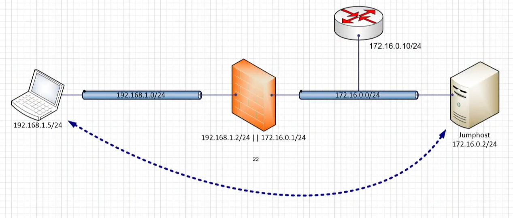
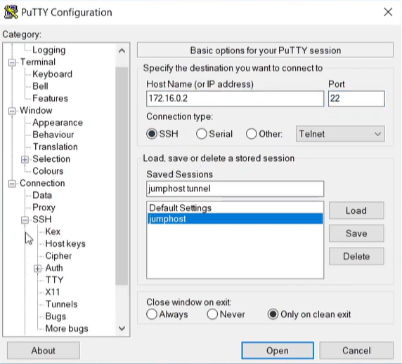
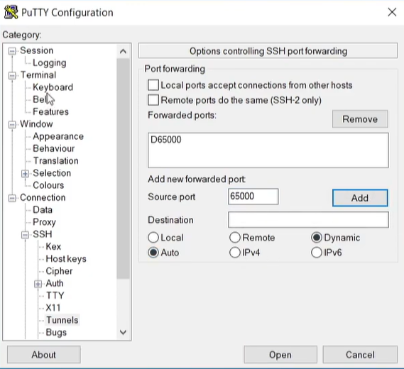
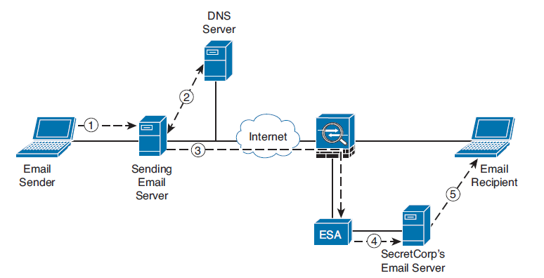
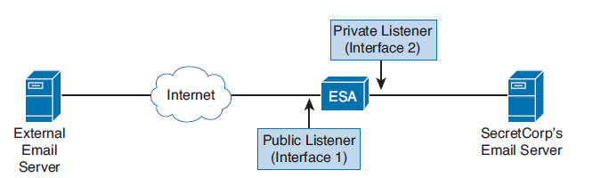

# 🛡️ Content Security: Cisco WSA, ESA & SMA Architecture

When discussing Cisco Web Security Appliance (WSA), Email Security Appliance (ESA), and Security Management Appliance (SMA), they all share a common denominator: **AsyncOS**.

AsyncOS is a highly optimized operating system based on FreeBSD, designed specifically to handle asynchronous connections. In short: the OS does not sit idle waiting for a server to respond. It immediately establishes subsequent connections. This massive resource saving allows these appliances to analyze thousands of emails and web pages simultaneously without choking the CPU.

---

## 🌐 Cisco WSA (Web Security Appliance)

WSA is a dedicated Secure Web Gateway. Here is a breakdown of its core capabilities:

*   **Web Reputation:** Scans over 200 parameters to evaluate if a site is trustworthy on a scale from -10 to +10.
*   **Web Filtering (formerly URL Filtering):** The name was changed because old URL filtering relied on static databases. Modern Web Filtering uses *Dynamic Content Analysis*, reading the webpage on the fly and categorizing it (e.g., Gambling, News).
    > **💡 Reputation vs. Filtering (What's the difference?)**
    > These are two entirely different engines! 
    > *Example:* An employee visits `local-news.com`. **Web Filtering** categorizes it as "News". News is allowed by company policy, so it passes. Then, **Web Reputation** kicks in. It notices the domain was registered yesterday on a high-risk server in Russia and gives it a score of `-8`. *Result:* The page is ultimately blocked.
*   **AUP (Acceptable Use Policy):** Granular policies. We don't just block the "Entertainment" category. We can throttle bandwidth, set time quotas (e.g., max 1 hour of YouTube per day), or display warning pages.
*   **AVC (Application Visibility and Control):** Deep inspection. We can allow Facebook and Twitter but strictly block Facebook Games or Twitter file uploads.
*   **Cloud Access Security (CASB):** Cisco can protect data even in the cloud (e.g., SharePoint) using the integration of WSA, AVC, and **CloudLock** (a CASB broker Cisco acquired in 2016). If an employee uploads a virus from their private phone to the corporate cloud, this solution detects it.
*   **Antivirus:** Multiple engines available (Sophos, Webroot, McAfee).
*   **File Reputation:** Powered by Cisco Talos, updated every 3-5 minutes.
*   **DLP (Data Loss Prevention):** WSA can forward content to 3rd-party DLP systems to scan for confidential data leaks.
*   **Malware Analytics (Sandboxing):** Unknown files are sent to a secure sandbox (Threat Grid / Secure Malware Analytics) for detonation.
*   **File Retrospection:** If a file was deemed safe yesterday but Talos discovers it's a zero-day malware today, WSA retroactively alerts the admin.
*   **CTA (Cognitive Threat Analytics):** Even if traffic is encrypted, CTA recognizes threats based on specific metadata (SNI during the handshake, timing patterns, specific packet sizes). *Example:* A host sending a specific 50-byte packet exactly every 5 minutes. Cisco catches these anomalies based on Talos patterns.

### 🔌 WSA Port Architecture

*   **M1 (Management Port):** Can be used purely for management, or for both management AND data traffic (receiving/sending to the internet). This requires connecting to a switch and is called a **One-Armed** deployment.
*   **P1 & P2 (Data Ports):** Used strictly for receiving and sending traffic. They must be in separate subnets. *Example:* P1 collects all LAN traffic, P2 sends it to the internet. M1 remains strictly for Out-of-Band (OOB) management.

<pre style="background-color: #000000; color: #00ff00; padding: 15px; font-size: 13px; border-radius: 8px; border: 1px solid #444; line-height: 1.2; overflow-x: auto;">
       [ USERS ] (VLAN 10, VLAN 20, etc.)
           |
           v
+-----------------------------+
|      Core Switch (L3)       | <--- Collects traffic from all VLANs and 
+-----------------------------+      routes it to the IP of Port P1.
           |
           | (Inbound LAN Traffic)
           v
     [ P1 Interface ]
+-----------------------------+      [ M1 Interface ]
|                             |             | (OOB Management Only)
|         Cisco WSA           |-------------+-----> [ Admin Switch ]
|                             |                       (Your access)
+-----------------------------+
     [ P2 Interface ]
           |
           | (Outbound DMZ Traffic)
           v
+-----------------------------+
|       Edge Firewall         | <--- Performs NAT and sends P2 traffic out.
+-----------------------------+
           |
           v
      [ INTERNET ]
</pre>

*   **T1 & T2 (Promiscuous Ports):** Used exclusively for inspecting Layer 4 traffic. We configure SPAN (Mirror) ports on a switch and direct LAN traffic to T1 and Internet traffic to T2.

---

### 🔄 Proxy Deployment Modes

#### 1. Explicit Forward Proxy
The assumption here is that clients *know* they are using a proxy. Clients do not perform DNS queries; the WSA does it for them.
Configuring this manually on every Windows PC is a nightmare. Therefore, enterprises use **WPAD (Web Proxy Auto-Discovery)**. 
*   **How it works:** It is implemented in every modern browser. The browser looks for DHCP Option 252, which points to a `.wpad.dat` file. If DHCP fails, the browser automatically queries DNS for `wpad.company.local`. The `.dat` file (usually hosted on the WSA itself) contains the exact instructions on how to reach the proxy.

#### 2. SOCKS Proxy & SSH Tunneling
SOCKS is a Layer 4/5 protocol. Because of this, WSA cannot perform DLP, AVC, malware detection, or decryption (it cannot look inside the payload), nor can it chain to upstream proxies. However, it allows proxying non-HTTP traffic (RDP, SSH, FTP).

**The SSH Tunneling Scenario:**
Imagine port 22 (SSH) is open on the firewall, but you want to access a router's GUI (HTTP/HTTPS) from your Windows PC. You can't just RDP into the Ubuntu server. This is where SOCKS proxy and SSH tunneling come in.

  

*(Note: SSH is not just a pipe; it can create virtual, isolated channels inside itself—known as multiplexing).*

In Putty, you configure a Jump Host. Under SSH Tunnels, you select a port (e.g., `65000`) and set it to **Dynamic**. This creates a local SOCKS proxy server on your PC (`127.0.0.1:65000`). 

  

  

**The Mechanism:** Your browser connects to the local SOCKS proxy. Putty packs it into the SSH tunnel, and the Ubuntu server forwards it to the router. In this context, the *real* proxy is the Ubuntu server!

**How does WSA handle SOCKS?**
WSA takes the place of the Ubuntu server, acting as the native SOCKS Proxy. Applications like FileZilla or Firefox have native SOCKS clients built-in. You just enter the WSA's IP. The client opens a connection to port `1080` (default) and packs FTP inside. WSA intercepts it, strips the SOCKS wrapper, and sends it to the destination. 
*Security Note:* In this scenario, WSA acts purely as a dumb pipe. Almost no security mechanisms are applied!

---

#### 3. Transparent Proxy (WCCP & PBR)
In this mode, clients have no idea a proxy exists. Network devices intercept the traffic using **PBR (Policy-Based Routing)** or **WCCP (Web Cache Communication Protocol)**.

**WCCP (Cisco Proprietary):**
Unlike standard routing (which routes based on Destination IP), WCCP routes based on the *type of traffic* (e.g., catching all HTTPS traffic and forcing it to the proxy). 
If WSA is in a different subnet, WCCP uses GRE tunnels. If in the same subnet, it uses L2 Rewrite (MAC address swapping).
*   **Load Balancing:** As traffic grows, you add another WSA. WCCP distributes traffic automatically based on hashes.
*   **Fault Tolerance:** The router constantly exchanges Hello packets with the WSA. If WSA-1 dies, traffic is shifted to WSA-2.
*   **Service Assurance (Failsafe):** If ALL WSAs die, WCCP simply stops intercepting traffic and lets it flow directly to the internet, ensuring users don't lose connectivity.

> **🛑 Deep Dive: WCCP & The Asymmetric Routing Nightmare**
> Sometimes we want to use **IP Spoofing** on the WSA. Normally, WSA replaces the client's source IP with its own. With spoofing, WSA keeps the client's original IP (useful if there is an IPS behind the firewall that needs to see the real client IPs).
> 
> **The Problem:** 
> 1. Laptop (`10.1.1.50`) sends a packet to `cisco.com` (`8.8.8.8`).
> 2. Router intercepts it via WCCP and sends it to WSA (`10.1.1.10`).
> 3. WSA processes it and sends it to the internet, *spoofing* the source IP as `10.1.1.50`.
> 4. `cisco.com` replies to `10.1.1.50`.
> 5. **The Black Hole:** The reply packet hits the corporate router. The router looks at its routing table: *"Ah, 10.1.1.50 is on my LAN."* It sends the packet DIRECTLY to the laptop, bypassing the WSA!
> 6. The laptop rejects it (TCP RST) because it expects a reply from the proxy session. The WSA waits forever. The page doesn't load.
> 
> **The Solution (Two WCCP Services):**
> You must force the return traffic back to the WSA to close the session and scan it for viruses!
> *   **Service 1 (Dst Port 80/443):** Applied on the router's LAN interface. Catches outbound traffic and sends it to WSA.
> *   **Service 2 (Src Port 80/443):** Applied on the router's WAN interface. Catches inbound return traffic. The router sees: *"This is going to 10.1.1.50, but it came from port 443."* It intercepts it and loops it back to the WSA. The WSA scans it and delivers the clean payload to the laptop.

---

## 📧 Cisco ESA (Email Security Appliance)

Before diving in, let's clarify email infrastructure terminology:
*   **MTA (Mail Transfer Agent):** Transfers emails from sender to receiver. (e.g., A mail server or the ESA itself, as it receives, scans, and forwards).
*   **MDA (Mail Delivery Agent):** A component of the destination server. Saves the message to the hard drive.
*   **MUA (Mail User Agent):** The email client (Outlook, Thunderbird).
*   **MSA (Mail Submission Agent):** A component of the MTA that receives emails from the client.

<pre style="background-color: #000000; color: #00ff00; padding: 15px; font-size: 13px; border-radius: 8px; border: 1px solid #444; line-height: 1.2; overflow-x: auto;">
[ SENDER ]                                                  [ RECEIVER ]
Alice (PC)                                                   John (PC)
    |                                                            ^
    | 1. Sending                                                 | 4. Receiving
    | Protocol: SMTP (Port 587)                                  | Protocol: IMAP (Port 993)
    | Role: MUA (Mail User Agent)                                |           or POP3 (Port 995)
    v                                                            | Role: MUA (Mail User Agent)
+------------------+                                      +------------------+
|   GMAIL SERVER   |       2. Internet Transport          |  INTERIA SERVER  |
|                  |------------------------------------->|                  |
| Role 1: MSA      |       Protocol: SMTP (Port 25)       | Role 1: MTA      |
| (Receives from   |       (Based on DNS MX Record)       | (Receives from   |
|  Alice)          |                                      |  Internet)       |
|                  |                                      |                  |
| Role 2: MTA      |                                      | Role 2: MDA      |
| (Sends to world) |                                      | (Saves to disk/  |
+------------------+                                      |  mailbox)        |
                                                          +------------------+
</pre>
*(Note: IMAP leaves the message on the server for viewing across devices. POP3 downloads it and deletes it from the server to save space).*

### ESA Deployment & Listeners

To deploy ESA, we must change the global DNS **MX (Mail Exchanger)** record to point to the ESA's public IP address instead of our actual mail server.

  

In Cisco architecture, an ESA is essentially an SMTP service that listens for connections. We divide these into:
*   **Public Listeners:** Face the internet. We deploy the heaviest artillery here to block external threats.
*   **Private Listeners:** Catch outbound traffic from our internal Exchange server. We use different defense mechanisms here, primarily **DLP (Data Loss Prevention)** to stop employees from leaking secrets.

  

### 🛡️ ESA Security Features

*   **SenderBase:** The equivalent of Web Reputation, but for emails (-10 to +10 score). If an email is suspicious, it goes to the AV engine. If it's clean but Talos notices anomalies, it goes to the **Quarantine (Freezer)**. This gives Cisco a 9-hour head start over traditional viruses before AV signatures are even written!
*   **RAT (Recipient Access Table):** Configured on Public Listeners to strictly define which destination domains we actually accept mail for.
*   **SPF (Sender Policy Framework):** A DNS TXT record where we declare which IP addresses are legally allowed to send emails on behalf of our domain. 
    *   *The Hacker Trick:* A hacker doesn't use Outlook. They open a terminal and type `telnet your_esa_ip 25`. This opens a raw TCP pipe. They type SMTP commands in plain text to spoof your CEO's email. If SPF is enabled, the ESA checks the DNS, sees the hacker's IP is not authorized, and drops the connection!
*   **DKIM (DomainKeys Identified Mail):** Ensures authenticity and integrity. The ESA generates a Private/Public key pair. It hashes important email headers, encrypts the hash with the Private Key, and attaches it to the email. The Public Key is placed in a global DNS TXT record. The receiving server uses the Public Key to decrypt and verify that the email wasn't tampered with in transit.

---

### ☁️ Cisco Cloud Email Security (CES) & Advanced Engines

Besides the physical/virtual ESA appliances, Cisco also offers a fully cloud-based solution: **Cisco Cloud Email Security (CES)**. Regardless of whether you use the on-premise ESA or the cloud CES, they both rely on several advanced scanning engines:

*   **CASE (Context Adaptive Scanning Engine):** This is the core scanning engine in Cisco email security. It analyzes hundreds of thousands of email attributes (the context) and correlates them in real-time with Cisco Talos. It assigns a score to every email. Based on this score, it can trigger **Outbreak Filters** to throw suspicious emails into quarantine and rescan them cyclically as new threat intelligence arrives.
*   **FED (Forged Email Detection):** This is your primary defense against Spear Phishing and **BEC (Business Email Compromise)**—commonly known as the *"CEO Fraud"*. This feature deeply inspects and compares SMTP headers. It checks if the visible `From:` header (which is easily spoofed) matches the hidden `Envelope From:` and the `Reply-To:` headers.
    > **⚠️ The Display Name Trick (Why FED is crucial):** 
    > Even if DMARC passes successfully, a hacker can still manipulate the "Display Name" (e.g., changing it to "CEO John Smith"). DMARC does not check the Display Name! Outlook will only show this fake name, and Karen from Accounting might fall for it. FED specifically looks for these Display Name anomalies to stop this attack.

---

### 🛡️ The "Holy Trinity" of Email Authentication (SPF, DKIM, DMARC)

#### Why is SPF alone not enough?
SPF only checks if there is an IP match for the domain written on the "Envelope" (the `MAIL FROM` / `Envelope Sender` command during the SMTP handshake). 
However, the actual "Letter inside the envelope" (the `From:` header that the user actually sees in Outlook) can be easily spoofed. SPF DOES NOT check the letter inside!

**How a hacker bypasses SPF:**
1. The hacker buys a cheap domain `hacker.com` and sets up a 100% valid SPF record for it (assigning their own IP).
2. The hacker connects to your server and sends an email.
3. On the "Envelope" (`MAIL FROM`), the hacker writes: `spam@hacker.com`.
4. In the "Letter inside" (`From:` header), the hacker writes: `ceo@yourcompany.com`.
5. Your Cisco ESA receives the email. It looks at the envelope (`hacker.com`), queries DNS for `hacker.com`, and checks the hacker's IP.
6. **SPF Result: PASS!** The hacker's IP matches `hacker.com`. The ESA says: *"Everything is legal, let it through."*
7. The email lands in the accountant's Outlook. Outlook throws away the "envelope" and only displays the "letter inside": *From: ceo@yourcompany.com*.

#### Enter DMARC (The Hero in White)
This is exactly where DMARC steps in to save the day.
DMARC says: *"Wait a minute. SPF passed the test for the domain `hacker.com` (the envelope), but the accountant is seeing the domain `yourcompany.com` (the letter). These two domains do not match (Lack of Alignment)! This is a fraud, drop the email!"*

> **💡 Summary:** DMARC is a global standard that forces the "Envelope" (checked by SPF) and the "Letter" (seen by the user) to align perfectly. If they don't, DMARC instructs the receiving server to Reject or Quarantine the email, completely killing domain spoofing attacks..