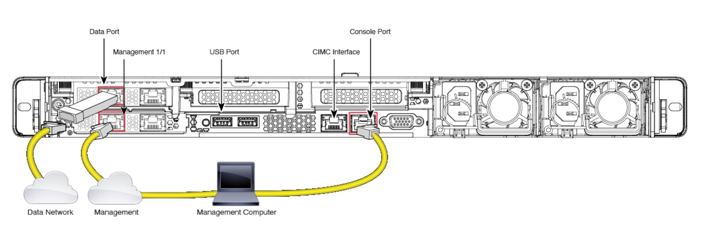

# 🎛️ Initial Configuration of FMC (Firepower Management Center)

Initial configuration

  

### 🔌 Initial Access Methods

You can gain initial access to a hardware FMC appliance in several ways:

1.  **Direct Laptop Connection (MGMT Port):** Plug your laptop directly into the physical port labeled `MGMT1/1` (Logically, this maps to the `eth0` interface in the OS). The port acts as a DHCP server. If for some reason DHCP fails to assign you an IP, the interface defaults to a fallback IP address: **`192.168.45.45`**.
2.  **Console Cable:** Connect a standard Cisco serial console cable to the `Console` port.
3.  **VGA Monitor & Keyboard:** Connect a physical monitor to the VGA port and a USB keyboard directly to the appliance.
4.  **CIMC (Cisco Integrated Management Controller):** If configured, you can access the out-of-band server management interface (similar to iLO on HP or iDRAC on HP/Dell).

---

### ⚠️ The Password Trap (CLI vs. GUI)

During the initial Bootstrap process, you will be prompted to create an Admin password. At that specific moment, the password you set is applied to **both** the CLI and the Web GUI.

**However, after the initial setup, these passwords live completely separate lives!** 

If you log into the Web GUI later and change your Admin password in the settings, it **ONLY** changes the GUI password. The underlying Linux CLI password remains the original one set during Bootstrap. Many engineers trip over this and accidentally lock themselves out of the CLI!