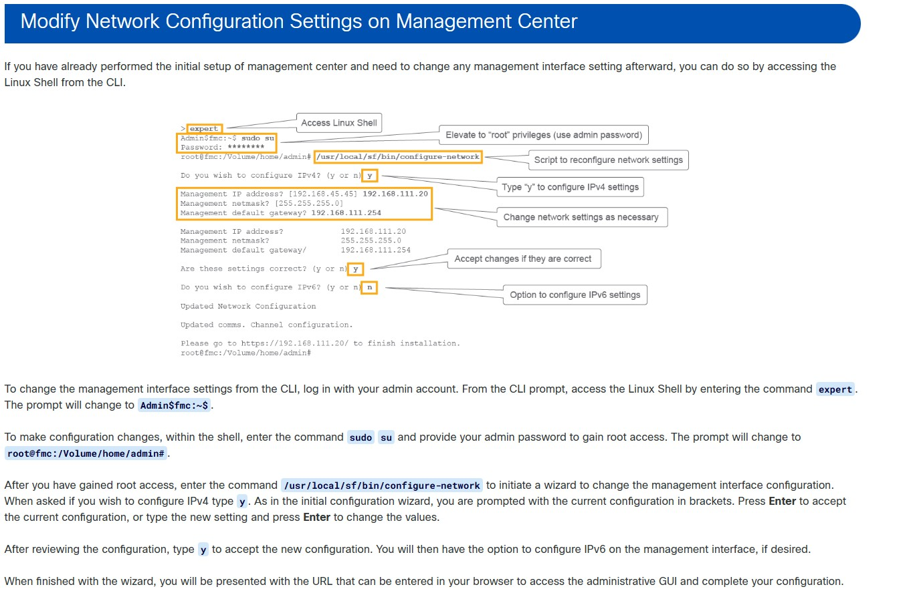

---

### 🔧 Modifying Network Settings (The Expert Mode)

If you made a mistake during the initial FMC setup (e.g., wrong IP address or Gateway), you can modify these settings via the CLI. 

To do this on the FMC, you must enter the underlying Linux shell by typing the `expert` command, and then run the network configuration script:

<pre style="background-color: #000000; color: #00ff00; padding: 15px; font-size: 14px; border-radius: 8px; border: 1px solid #444; line-height: 1.2;">
> expert
admin@fmc:~$ sudo /usr/local/sf/bin/configure-network
</pre>

  

> **🛑 WARNING: Expert Mode on FTD vs. FMC**
> While the FMC allows you to configure network settings via the `expert` mode script shown above, **NEVER try this on an FTD (Firepower Threat Defense) firewall!**
> 
> FTDs also have an `expert` mode, but it is strictly for advanced troubleshooting and TAC support. If you need to change the IP address or passwords on an FTD, you must ALWAYS use the official Clish commands (e.g., `> configure network ipv4 manual...`). Trying to change passwords or IPs directly from the underlying Linux shell on an FTD will break the system's internal synchronization!