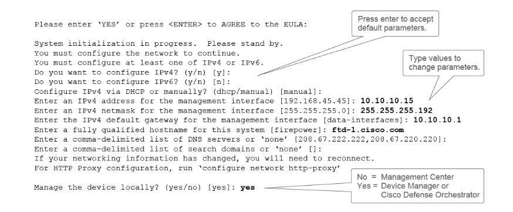

# 🧱 Cisco FTD: Out-of-the-Box Setup & Bootstrap

When you take a brand new Cisco Firepower device out of the box (e.g., FPR 1000, 2100, or 3100 series), you can gain initial access to it in three different ways:

1.  **Via the MGMT Port:** Connect the Management (MGMT) port to a network that has an active DHCP server. By default, this port is configured as a DHCP client.
2.  **Via the Inside Port:** Connect your laptop directly to the `Inside` port (usually `GigabitEthernet1/2`). Configure your laptop's network card to obtain an IP address automatically. By default, the FTD runs a DHCP server on this port.
3.  **Via Console Cable (Bootstrap):** Connect using a serial console cable and run through the CLI Bootstrap process.

> **💡 What is Bootstrap?**
> Bootstrap is simply the industry term for the initial, fundamental configuration required to get a new device up and running on the network.

---

### 🛠️ The Bootstrap Process (CLI)

During the CLI bootstrap wizard, you will be prompted to enter basic network settings (IPv4/IPv6, Gateway, DNS). 

  

