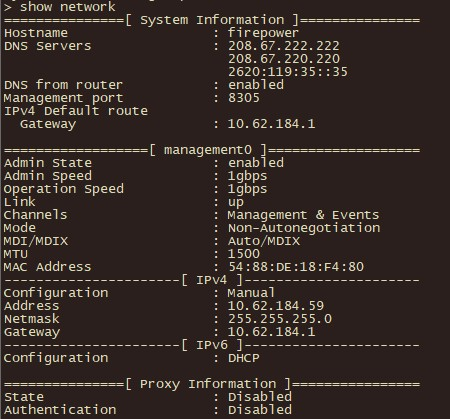

# 🧱 Cisco FTD: Out-of-the-Box Setup & Bootstrap

When you take a brand new Cisco Firepower device out of the box (e.g., FPR 1000, 2100, or 3100 series), you can gain initial access to it in three different ways:

1.  **Via the MGMT Port:** Connect the Management (MGMT) port to a network that has an active DHCP server. By default, this port is configured as a DHCP client.
2.  **Via the Inside Port:** Connect your laptop directly to the `Inside` port (usually `GigabitEthernet1/2`). Configure your laptop's network card to obtain an IP address automatically. By default, the FTD runs a DHCP server on this port.
3.  **Via Console Cable (Bootstrap):** Connect using a serial console cable and run through the CLI Bootstrap process.

> **💡 What is Bootstrap?**
> Bootstrap is simply the industry term for the initial, fundamental configuration required to get a new device up and running on the network.

---

### 🛠️ The Bootstrap Process (CLI)

During the CLI bootstrap wizard, you will be prompted to enter basic network settings (IPv4/IPv6, Gateway, DNS). 

  

---

### 🔍 Verifying and Modifying Network Settings

To verify the correctness of the network data you entered during the bootstrap process (such as IP address, Gateway, and DNS), you can use the `show network` command in the CLI.

  

If you made a mistake or simply need to change the Management IP address later, you can correct it manually using the following command format:

<pre style="background-color: #000000; color: #00ff00; padding: 15px; font-size: 14px; border-radius: 8px; border: 1px solid #444; line-height: 1.2;">
> configure network ipv4 manual 10.62.184.59 255.255.255.0 10.62.184.1
</pre>
*(Syntax: `configure network ipv4 manual <IP_ADDRESS> <SUBNET_MASK> <GATEWAY>`)*

#### Securing GUI Management Access (HTTPS ACL)
By default, the firewall might restrict who can access its web interface FDM. You must define which IP addresses or subnets are allowed to access the HTTPS management portal.

To allow access from anywhere (for initial lab setup or before tightening security), you can use the following command:

<pre style="background-color: #000000; color: #00ff00; padding: 15px; font-size: 14px; border-radius: 8px; border: 1px solid #444; line-height: 1.2;">
> configure https-access-list 0.0.0.0/0
</pre>
*(Note: In a production environment, you should replace `0.0.0.0/0` with your specific Management VLAN or Admin PC subnet to ensure secure access).*