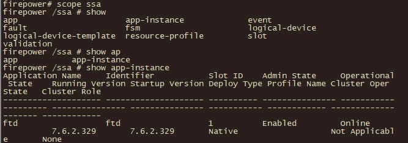

----

### Verify Installed Software

After you have logged into the console of the threat defense device, you should verify that the installed software is what you expect it to be.

To verify the installed software, you will first need to access the security services (SSA) scope. At the FXOS CLI, enter the command `scope SSA`.

The prompt will change to `Firepower /ssa #`.

After you have accessed the SSA scope, enter the command `show app-instance` to verify the installed software on the device.

<pre style="background-color: #000000; color: #00ff00; padding: 15px; font-size: 14px; border-radius: 8px; border: 1px solid #444; line-height: 1.2;">
Firepower# scope ssa
Firepower /ssa # show app-instance
</pre>

For example, the figure shows that the installed software is ftd (threat defense) and that the version that is installed is 7.6.2.329

  

