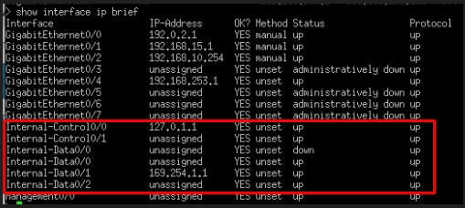

# 🧱 Cisco FTD: LINA, Snort & Internal Interfaces

If you look closely at the output of the `show ip` command on an FTD device, you will notice a section filled with strange, hidden IP addresses labeled **Internal-Control** and **Internal-Data**.

  

Have you ever wondered what these addresses are actually for? 
They exist to facilitate communication between the legacy ASA firewall engine (**LINA**) and the next-generation inspection engine (**Snort**).

### 📞 1. Internal-Control (e.g., 127.0.1.1)
Think of this as their secret, internal corporate phone line. 
This is the path used strictly for management traffic. The LINA engine and the Snort engine use this connection to exchange configurations, push security policies, and monitor each other's health.

### 🚰 2. Internal-Data (e.g., 169.254.1.1)
This is a massive, internal pipeline dedicated exclusively to user data packets!
**How it works:** A packet from the internet hits the physical `Outside` port. The LINA engine performs basic routing and says: *"Okay, now I need to hand this over to Snort to scan it for viruses."* LINA grabs the packet and throws it into this "internal pipe" (Internal-Data). Snort catches it on the other side, deeply inspects it, and throws it back to LINA.

#### Why are there multiple Internal-Data interfaces?
Because one Snort process isn't enough to handle a massive 10 Gbps traffic load. For efficiency and multi-core processing, the system spins up multiple, identical copies of the Snort process. Each process gets its own dedicated pipe.

#### Why do some of them NOT have IP addresses?
You might notice that most of these internal data interfaces show up without an IP address. 

Cisco programmers designed this brilliantly:
These interfaces operate as **Raw Sockets**. They work literally like a slide on a playground! 🛝
The LINA engine does not bother wrapping the packet in a new, internal IP address. It simply "drops" the raw, unaltered packet straight down the slide. Snort catches it at the bottom, scans it for malware, and throws it right back up. 
**Zero internal IP addressing, zero internal routing table lookups—just pure, hardware-level speed!**