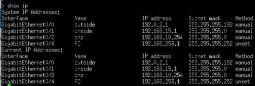
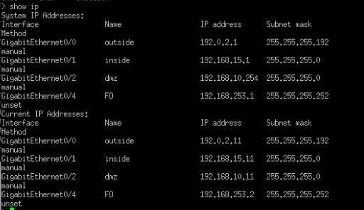
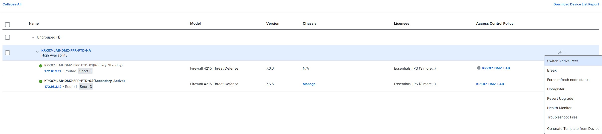
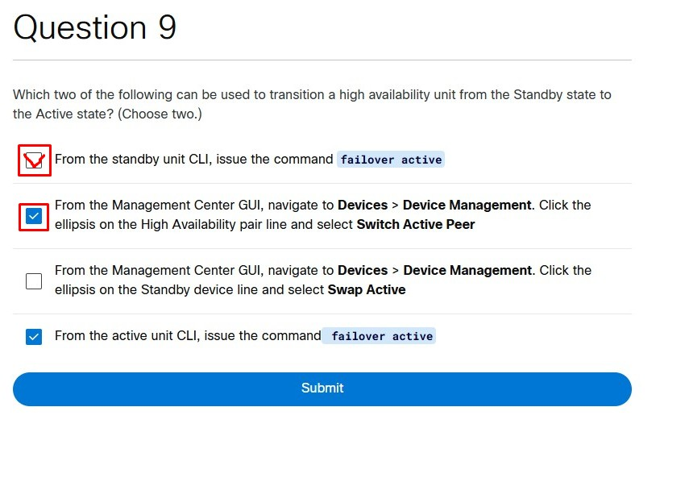

# 🧱 Cisco FTD: High Availability (HA) & Failover

When configuring High Availability (HA) on Cisco Firepower devices, you might not notice it at first, but the output of the `show ip` command can differ significantly between the Active and Standby units.

  

  

### Understanding the IP Output
*   **System IP Addresses:** These are the IP addresses assigned to the **Active** unit.
*   **Current IP Addresses:** These are the actual IPs configured on the "bare metal" (the physical unit you are currently logged into).

The first screenshot shows the Active unit because both sections (System and Current) are identical.

### Why do we configure Standby IPs?
In an HA setup, we must configure dedicated IP addresses for the Standby unit. It's not like the Standby unit sits completely idle. It works quietly in the background, checking connectivity and communicating with the Active unit. Additionally, these extra IPs are used for running LAN health tests.

**What happens during a failover?**
If, for example, the `outside` interface dies on the Active unit but is fully functional on the Standby unit, a failover occurs. 
*The crucial rule:* The Standby unit takes over the Active unit's IP address! The Standby unit *cannot* use its own Standby IP to serve traffic. Think about the PCs on your network—they have the Active IP hardcoded as their Default Gateway. If the IP changed, the whole network would drop!

---

### 🔀 Manual Failover (Passing the Crown)

Sometimes you need to trigger a failover manually (e.g., during a maintenance window or an upgrade). You can do this via the CLI or the FMC GUI.

#### Method 1: Via CLI (LINA Engine)
The command you use depends entirely on which unit you are currently logged into:

*   **On the STANDBY Unit (The Deputy):**
    If you log into the Deputy and want it to take control, you type:
    `> failover active` 
    *(Translation: "Give me the crown, I am taking over the company!")*

*   **On the ACTIVE Unit (The Boss):**
    If you log into the current Boss and want to hand over control to the Deputy, you type the exact opposite:
    `> no failover active`
    *(Translation: "I abdicate the crown, I hand over power!")*

  

#### Method 2: Via FMC GUI
You can easily switch roles from the FMC dashboard by clicking the "Switch Active Peer" icon next to your HA pair.

  

---

### 🧠 Quick Knowledge Check (Exam Prep)

Look at the image below and analyze the HA transition states. Can you deduce what is happening?

  

