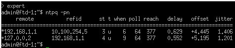

# ⏱️ NTP Troubleshooting: The `ntpq` Command

  

**`ntpq`** is a Linux utility used to query the NTP daemon's internal memory and retrieve its synchronization status.

Command breakdown: `ntpq -pn`
*   **`-p` (Peers):** Prints a neatly formatted table of the peers known to the server.
*   **`-n` (Numeric):** Forces the program to output IP addresses numerically. If we didn't use this, the program would try to translate IPs into DNS names, causing delays. With `-n`, the output is instant.

### Understanding the Columns

**The `remote` column:**
*   In the first line, the main server is `192.168.1.1`. The asterisk (`*`) indicates that we are currently using it as our active synchronization source.
*   The second line (`127.0.0.2`) is our backup server. The plus sign (`+`) indicates that it is a valid candidate (a backup).

**The `refid` column:**
*   This informs us where the servers from the first column got *their* time from.
*   For example, server `192.168.1.1` gets its time from `10.100.254.5`, which is one stratum higher (Stratum 2).
*   Server `127.0.0.2` gets its time from `192.168.1.1`.

> **⚠️ Important Note on Stratum:**
> If you look at the stratum layers and see the number **16**, it means the server is **unreachable**. The total number of valid network layers is 15.
> *Why?* Stratum 0 devices are reference clocks (Atomic clocks, GPS). These "gods of the internet" do not talk via the NTP network protocol; they are connected via a special physical cable to a Stratum 1 server. Therefore, the last valid layer is 15. If it says 16, the chain is broken.

**The `reach` column:**
In our output, you can see the number **377**. This indicates a perfectly successful connection 8 times in a row.
*How?* The reach field is an 8-bit shift register displayed in octal (base-8) format. The binary value `1111 1111` (8 successes) translates exactly to the number `377` in octal.
*How?* The reach field is an 8-bit shift register displayed in octal (base-8) format. The binary value `1111 1111` (8 successes) translates exactly to the number `377` in octal.