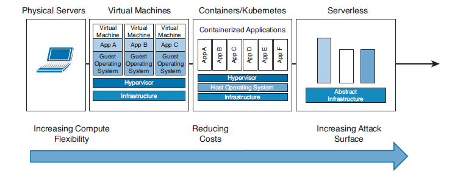
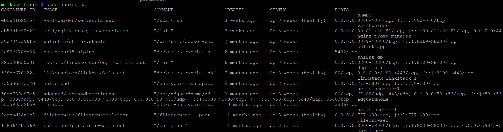
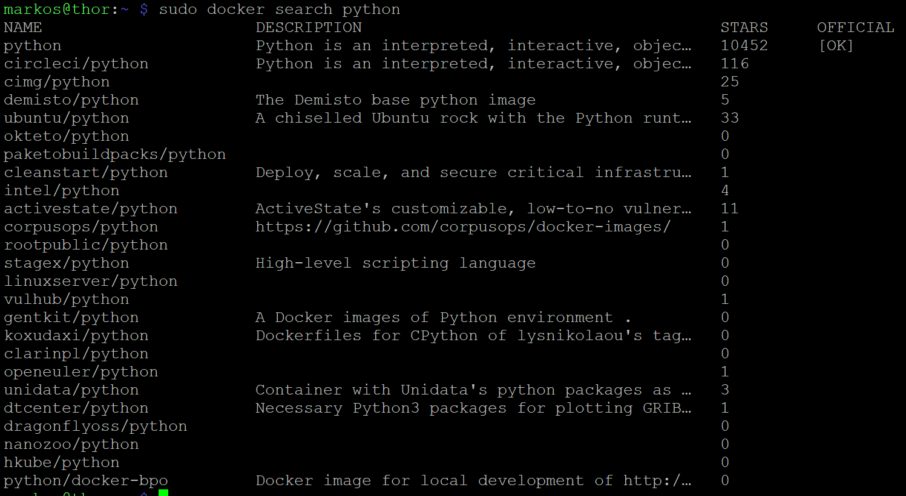
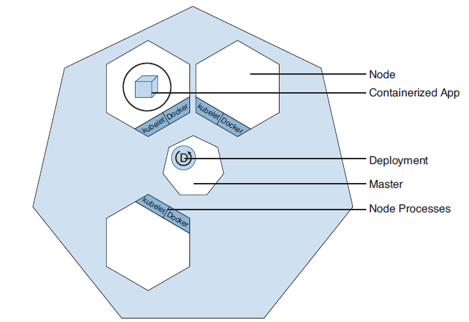
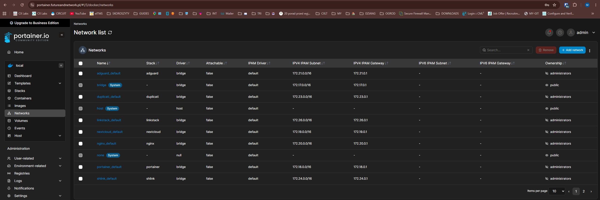
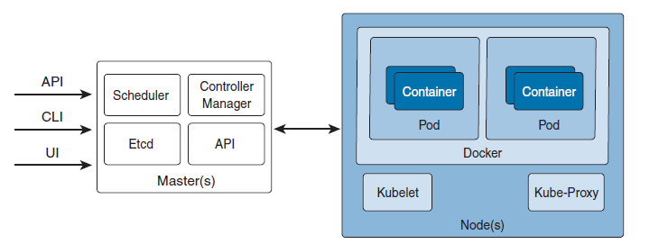

  

# 🐳 Containers, Kubernetes & Cloud Networking Architecture

Before we dive into containers, let's briefly touch on **Serverless Applications**. This is a fascinating concept mainly for developers. You can rent "compute" in the cloud to run a script. Under the hood, it is actually a container that spins up only when triggered by an event. The container runs the script and immediately vanishes. Unlike a standard container, this environment is ephemeral, and you only pay for the exact milliseconds it was running (e.g., AWS Lambda, Azure Functions, Google Cloud Functions).

---

## 📦 What is a Container?

There are several types of container engines on the market today:
1.  **Docker:** The most popular. It started the entire container boom.
2.  **Containerd & CRI-O:** The current market standard. Even Kubernetes dropped Docker as its runtime and now uses `containerd`.
3.  **Podman:** Developed by Red Hat. It is much more secure than Docker because it is "daemonless" (no central process) and does not require root privileges to run.
4.  **LXC (Linux Containers):** A slightly different approach. Instead of packing one small service into a container (like Docker), LXC encapsulates a stripped-down Linux OS. It acts more like a lightweight Virtual Machine.

### Why did the world fall in love with containers?
In the old days, a developer wrote an app on their laptop. They used specific libraries (e.g., OpenSSL for encryption) and a specific version of Python. When they deployed the app to the production server, it turned out the server had a different library version. The app exploded. 💥

To solve this, we pack everything into a hermetic box (an Image):
*   **Stripped-down OS File System:** (e.g., Alpine Linux).
*   **Language Runtime:** The engine that translates code for the CPU (e.g., Python 3.9).
*   **Libraries:** Ready-made modules with someone else's code (e.g., OpenSSL, Requests).
*   **Source Code:** The actual script written by the developer.

> **⚠️ Crucial Distinction: Image vs. Container**
> A Container is NOT an Image. A Container is a **running** Image. When the server launches an image, allocates RAM and CPU resources to it, the package comes to life and becomes a Container.

### The Overlay File System (Image Layers)
Images are built in layers, which is a brilliant approach.
*   **Layer A (Base):** A stripped-down Linux OS (Alpine).
*   **Layer B:** Someone takes Layer A and installs Python on it.
*   **Layer C:** Someone takes Layer B and adds Nginx + OpenSSL.
*   **Layer D (The Container Layer):** Layers A, B, and C are strictly **Read-Only**. Layer D is the only writable layer. Anything the running container modifies is written here as a thin film. If you destroy the container, Layer D is wiped, but the original Image (A, B, C) remains untouched.

*Security Context:* If a vulnerability is found in OpenSSL, you don't rebuild the whole system. You just swap Layer C for a patched one.
*Drivers:* The Linux kernel drivers that allow this layer stacking are `aufs` (legacy), `overlay` (newer), and `overlay2` (the newest and fastest).

Images are stored in a **Registry** (e.g., the public Docker Hub, AWS ECR, or a private corporate registry).

### The OCI Standard (Open Container Initiative)
Docker became so popular that it donated its image format to the community, creating the **OCI**. Thanks to this, Kubernetes is not tied to the Docker company. *(Analogy: Cisco invented CDP, and the industry created the open standard LLDP based on it).*

An OCI image also contains **Metadata** (the instruction manual for the engine):
*   What exact command to type to start the script?
*   Which network port should this container listen on (e.g., TCP 443)?
*   What environment variables to load?

*(Note: We often use YAML Manifests to declare how we want to run a container. Manifests are not metadata; they are configurations that override the metadata baked into the image).*

---

### 🛠️ Essential Docker Commands

  

*   `docker images`: Shows the list of Images downloaded to your local disk. These are the "dead packages" (read-only), ready to be launched.

  

*   `docker ps`: Shows currently running containers.
> **💡 Engineering TIP:** If a container crashes, you won't see it with `docker ps`. To see ALL containers (running, stopped, and crashed), you must use the flag: `docker ps -a` (all).

  

*   `docker search`: Searches the public registry for images. (You can also build your own images by creating a `Dockerfile` based on the OCI standard).

---

## 🎼 Container Orchestrators

Orchestrators are the "conductors" that manage massive amounts of containers. Think of them like FMC for Firepower, or Catalyst Center for switches, but for ephemeral infrastructure. If a container dies, the orchestrator spins up a replica in a fraction of a second.

1.  **Kubernetes (K8s):** The king of the market. Originally created by Google. It automates deployment and scaling of thousands of containers.
2.  **Docker Swarm:** Created by Docker. Used for smaller environments.
3.  **Nomad:** By HashiCorp.
4.  **Apache Mesos.**

*Fun Fact:* Kubernetes itself does not have its own container runtime; it is purely a management platform. It connects to physical/virtual servers and tells the engine (e.g., `containerd`): *"Hey, spin up 3 containers here."*

---

## ☸️ Kubernetes (K8s) Architecture

  

The entire Kubernetes entity is called a **Cluster**. Inside, we have:
*   **Master (Control Plane):** The brain/director. It can be a physical or virtual server running the K8s management software (API Server, Cluster State DB).
*   **Nodes:** The worker machines (physical or virtual). If you have 5 Dell servers in a rack, each is a Node.
*   **Kubelet & Docker/Containerd:** These run on every Node. If the Master is the Director, the **Kubelet** is the Site Foreman. It receives orders from the Master and tells the workers (the container engine) to execute them.
*   **Pod:** The smallest deployable unit in K8s. It is the circle around the container(s). A Pod can contain one or multiple containers. All containers inside a single Pod share the same IP address, port space, and storage volumes.

### 🕸️ The Networking Shift: Docker vs. Kubernetes

In a standalone Docker environment (without an orchestrator), containers are hidden behind NAT on a default bridge network (`172.16.0.0/16`). They can see each other, but the outside world cannot reach them without **Port Forwarding** (Destination NAT via `iptables`). 

  

*Modern Docker approach:* We use Docker Compose stacks, placing each stack in a different subnet with Port Forwarding, achieving microsegmentation and security. However, if we spun up a second Docker server, the containers couldn't talk to each other across servers because of the NAT.

**Kubernetes changes this entirely.** In a K8s cluster, *everything sees everything*. Node to Node, Pod to Pod, without any NAT! 

---

### 🔎 Kubernetes Architecture (Detailed)

  

You interact with the Master via CLI, GUI, or scripts by querying the **API Server**.
*   **etcd:** The cluster's highly available key-value database (think of it as the `startup-config`).
*   **Scheduler:** The planner. It looks at available resources and says: *"This Pod will go to Node #3."*
*   **Controller Manager:** The watchdog. If you requested 3 Web Servers and one Node burns down, the Controller notices the discrepancy and orders a new Web Server to spawn on a surviving Node.
*   **Kube-Proxy:** Runs on every Node. It modifies `iptables` firewall rules so packets reach the correct Pods. It is responsible for **Load Balancing**. If K8s creates a single Virtual IP for 5 Web Server Pods, Kube-Proxy ensures the traffic is distributed evenly among them.

*(Note: You can rent Kubernetes as a Service from cloud providers like GCP, Azure (AKS), or AWS (EKS).* 
*(For learning, you can use **Minikube**—it's like Packet Tracer/GNS3 for Kubernetes that runs locally on your laptop).*

---

## 🔌 Cloud Networking: The Contiv Plugin (CNI)

When K8s spins up a container, it needs an IP address. The **CNI (Container Network Interface)** plugin, such as Cisco Contiv, provides this.

In the K8s approach with a CNI, every container gets its own globally routable IP address within the cluster. Containers talk to each other on standard ports without NAT or Port Forwarding mapping nightmares.

**How does Contiv do this? VXLAN Overlay!**
Contiv builds an overlay network connecting all servers using VXLAN tunnels.
*   *Physical Switch Ignorance:* The physical underlay switch sees nothing but standard UDP traffic between servers. You don't need to configure static routing for container subnets on your Cisco hardware.
*   *CAM Table Protection:* The physical switch doesn't have to learn thousands of container MAC addresses, preventing CAM table overflow.

### Microsegmentation & Zero Trust
Since Contiv creates a flat network (every Pod can ping every Pod), there is zero default security. 
*   **Microsegmentation:** Contiv allows you to apply a firewall to every single container individually. This replaces traditional VLANs, which make no sense in the cloud.
*   **Application-Aware:** We don't write rules based on IP addresses (because container IPs constantly change). We write rules based on **Labels** (e.g., *"Allow the WEB app to talk to the DATABASE app"*).
*   **Zero Trust:** The default action is `deny ip any any`. Traffic only passes if explicitly allowed by a policy.

To make these label-based rules work, we rely heavily on **Service Discovery (Internal DNS)**. It is much better to route and block traffic by name than by ephemeral IP addresses.

Finally, since the external underlay network cannot reach the overlay network, we create a **NodePort**—a specific port forwarding rule that acts as a gateway from the outside world into the overlay network.