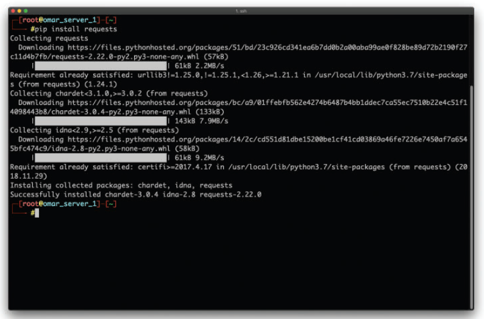
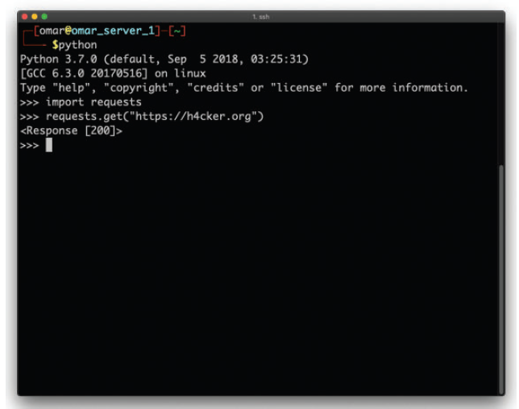
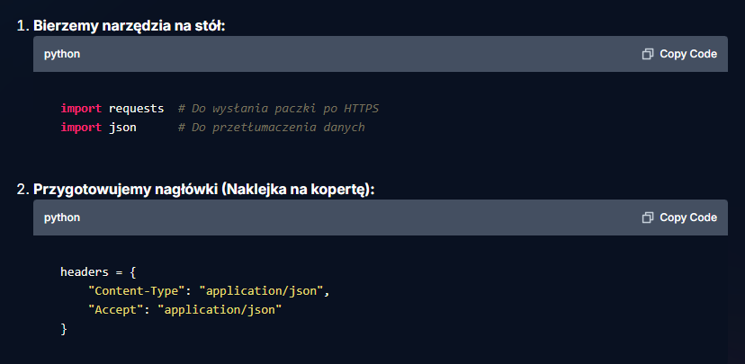

# 💻 Programming Languages: Compiled vs. Interpreted & Python Basics

### Why do compiled languages (like C++, Go) need to be translated upfront?

They require a "Build" (Compilation) phase. Before you can even run the program, a special tool (the compiler) takes your entire source code and translates it all at once into a ready-made machine code file (e.g., an `.exe` file in Windows). Only this finished, ready-to-run file is deployed to the server.

### Why is Python different?

Python is a scripting (interpreted) language. There is no "Build" phase here because the code is translated on the fly. 

When you run a script, a special program installed on the server (called the Python Interpreter) reads your `.py` text file line by line. In a fraction of a second, it translates the code into zeros and ones for the CPU in real-time as the program executes.

---

## 🐍 Python Basics for Network Engineers

When writing automation scripts (e.g., to connect to Cisco Catalyst Center via API), you don't have to write everything from scratch. You use libraries (ready-made modules of code). 

### 1. What is the famous `pip`?

Think of `pip` as the "Google Play" or "App Store", but for Python. 

When you type a command like `pip install requests` in your terminal, the system automatically reaches out to the internet, downloads the ready-made code package, and installs it on your computer.

  

 

The image above shows the download and installation of the `requests` library. This specific library is essential for handling HTTP/HTTPS connections, allowing our script to talk to REST APIs (like Cisco Catalyst Center).

### 2. The `import` command

Just because a library is installed on your hard drive doesn't mean your script knows about it. You must use the `import` command.

  

 

The `import` command loads the library from your hard drive into the RAM, making its functions available for your script to use.

### 3. Data Formats & The Built-in `json` Library

When interacting with modern network APIs (like Catalyst Center via RESTful API), the data is almost always exchanged in a specific format called **JSON**. 

In our Python script, we need a "translator" to convert raw text into a structured JSON object that Python can understand (and vice versa). 

  

 

*Notice:* We do not need to use `pip install json` to download this library. The `json` library is built directly into the core Python installation! All we have to do is `import json` at the top of our script, and the translator is ready to work.