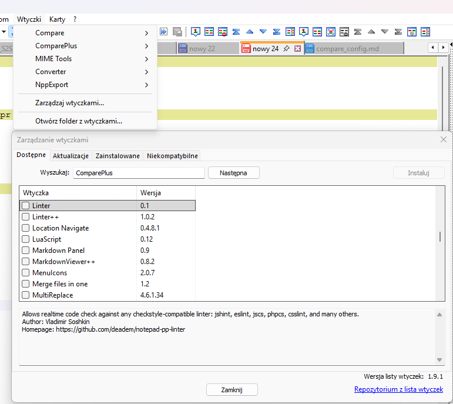
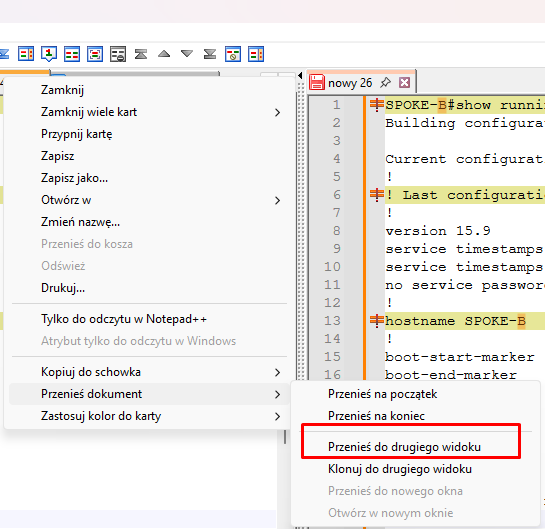
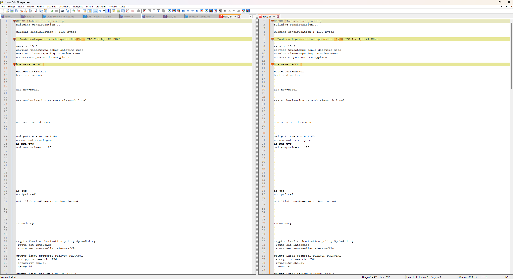

# 🛠️ Engineer's Tools: Comparing Configs in Notepad++

There have been countless times when I found myself digging through the depths of a broken configuration, trying to find a single typo by comparing it to a working config. I discovered that there is a brilliant, built-in way to do this in **Notepad++**.

Instead of straining your eyes, you can use the **ComparePlus** plugin to find the exact difference in 3 seconds.

---

### 📥 Step 1: Installing the Plugin

First, you need to install the plugin directly inside Notepad++.
1. Go to **Plugins** -> **Plugins Admin**.
2. Search for `ComparePlus`.
3. Check the box and click **Install** (Notepad++ will restart).

  

---

### ✂️ Step 2: Splitting the View

To comfortably compare two configurations, it's best to place them side-by-side on your screen.
1. Open both configuration files in Notepad++.
2. Right-click on the tab of the second file.
3. Select **Move to Other View**. 
Notepad++ will beautifully split your screen in half.

  

---

### 🔍 Step 3: Running the Comparison

Once your screen is split, simply use the magic shortcut:
**`CTRL + ALT + C`** (or go to Plugins -> ComparePlus -> Compare).

Below is the brilliant result we get. Let's see how perfectly it highlights the differences:

  

#### 🎨 Understanding the Colors

**Why is everything yellow?**
The yellow color indicates a **Modification**. The plugin noticed that line #13 exists in both files, but they are not identical.

**The Magic of Details (Dark Orange):**
Look at the brilliant detail the plugin provides! The entire line is pale yellow, but the specific letter "A" (in `SPOKE-A`) and the letter "B" (in `SPOKE-B`) are highlighted in a stronger, dark orange color. The plugin is literally pointing its finger at you saying: *"Hey, the difference is exactly this one single character!"*. It did the exact same thing with the timestamp in line #6.

**Where did the Green and Red go?**
They will appear when you scroll further down the file to places where the configurations actually differ in the *number* of commands, not just names:
*   🟩 **Green (Added):** Would pop up if Spoke-B had an extra command (e.g., `match identity`) that Spoke-A doesn't have at all.
*   🟥 **Red (Removed/Missing):** Would pop up on Spoke-A in the exact spot where it is missing a command that Spoke-B has.